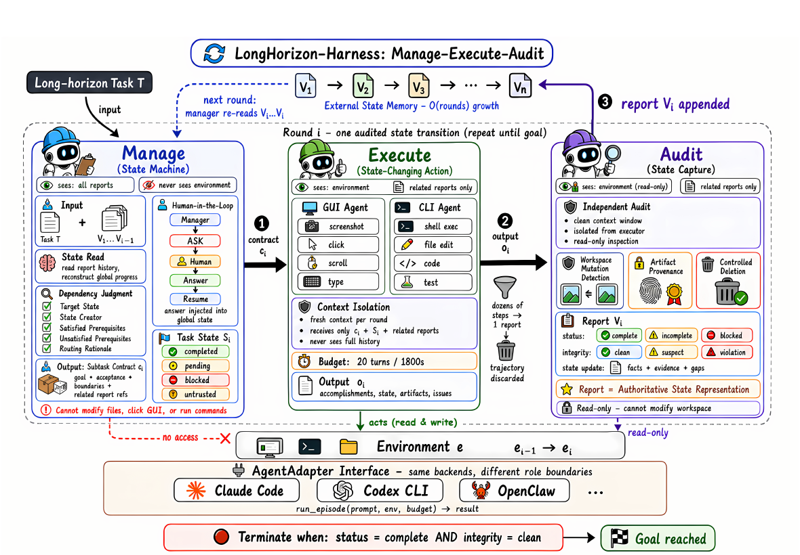

# 把长期 Agent 变成可审计状态机

语言：中文；[English companion](2608.01964.en.md)

> 主分类：[`AF`](https://github.com/legendtkl/agent-paper-daily/blob/main/docs/categories.md#af)；辅助分类：[`SY`](https://github.com/legendtkl/agent-paper-daily/blob/main/docs/categories.md#sy)、[`EV`](https://github.com/legendtkl/agent-paper-daily/blob/main/docs/categories.md#ev)、[`CU`](https://github.com/legendtkl/agent-paper-daily/blob/main/docs/categories.md#cu)

## 元数据

- 英文标题：LongHorizon-Harness: Advancing Long-Horizon Agents for Real-World Tasks
- 作者与机构：Ziyu Ma、Hailang Huang、Shun Zou、Yong Wang、Shidong Yang、Yiming Hu、Fei Wei、Xiangxiang Chu；DreamX Team, Alibaba Group
- arXiv：<https://arxiv.org/abs/2608.01964>
- PDF：<https://arxiv.org/pdf/2608.01964>
- 代码：<https://github.com/AMAP-ML/LongHorizon-Harness>
- 项目页：<https://lh-harness.pages.dev>
- arXiv 分类：cs.CV；内部分类：主分类 `AF`，辅助分类 `SY`、`EV`、`CU`
- 版本与时间：v1；首次提交与最近修订均为 2026-08-03 09:32:21 UTC
- 调研日期与复查日期：2026-08-05
- 热度证据：Hugging Face Daily Papers 127 票；GitHub 180 stars、14 forks；采集时间为 2026-08-05 09:06～09:13（Asia/Shanghai）
- 社区评价来源：Hugging Face 论文页、Hacker News Algolia、Reddit 指定社区、GitHub issues 和公开 X 搜索；采集时间为 2026-08-05 09:06～09:13（Asia/Shanghai）

## 结论摘要

- 论文把长任务从「不断增长的一条对话轨迹」改写为「经过审计的状态转移」。Manager 维护任务状态，Executor 在新上下文中执行一个有界子任务，Auditor 只读检查真实环境；只有通过审计的事实才进入跨轮次记忆。
- 同模型、同 Claude Code 执行后端的配对结果支持主要结论：Qwen 3.7-Plus 在 WeaveBench 的 PassRate 从 51.8% 升至 80.7%，在 Terminal-Bench 2.1 从 69.7% 升至 77.2%，在 OSWorld 2.0 的完整完成率从 2.8% 升至 8.3%。
- 提升不是免费的。WeaveBench 的总 token 为基线的 2.3 倍，OSWorld 2.0 的输出 token 为 3.6 倍；Terminal-Bench 2.1 则减少 24%。是否节省成本取决于模型能否用较少的审计—重做轮次完成子任务。
- 证据覆盖 114 个混合 GUI/CLI 任务、108 个桌面任务和命令行基准，但论文没有提供 Manager、Fresh Context、Read-only Auditor 等组件的系统消融，也未给 WeaveBench 和 OSWorld 主结果报告重复运行区间。
- 综合判断为 91/100，属于值得优先阅读的 Agent 架构论文。它改变的是长期执行的控制边界与可信状态表示，不是为模型补充新的单步能力。

## 研究问题与背景

长任务的核心困难不只是上下文变长。执行日志、任务状态和完成判断若长期共处在同一上下文中，早期错误会变成后续规划的前提；执行者还会把自己的「完成声明」误当作环境事实。论文将问题界定为任务状态管理：哪些要求已经满足、哪些产物真实存在、哪些事实得到环境证据支持，以及下一轮可以安全推进什么。

与简单的摘要压缩或周期性重启不同，LongHorizon-Harness 不把原始轨迹压缩后继续交给同一执行者，而是把跨轮次记忆收窄为结构化任务状态与审计报告。这一设计同时处理「上下文腐化」「错误自证」和「进度丢失」，代价是额外的模型调用、环境检查与运行时间。

## 核心方法

每轮采用 Manage–Execute–Audit（MEA）流程。Manager 读取原始任务、当前状态和历史审计报告，生成一个子任务契约，其中包含即时目标、验收标准、边界约束、依赖和相关证据；它无权直接查看或修改环境。Executor 是唯一可主动改变环境的角色，在全新的、有预算上限的上下文中执行该契约，只接收与当前子任务有关的状态和审计报告。Auditor 不读取执行者的原始推理轨迹，通过只读工具重新检查文件、界面、日志、进程和测试，并给出完成状态、完整性状态以及可写回的事实与证据。

终止条件同时要求 `status = complete` 与 `integrity = clean`。如果缺少信息或授权，Manager 可以进入 ask；如果没有许可范围内的动作能推进任务，则进入 blocked。统一的 AgentAdapter 保留 Claude Code、Codex CLI 或 OpenClaw 的原生执行循环，只控制角色上下文、权限、工具和预算。

图 2，论文第 3 页，原题「Overview of LongHorizon-Harness」。该图支持「执行、状态维护与环境核验被拆成权限不同的三个角色」这一结论。它表达的是设计约束，不单独证明性能提升；性能证据仍以表 1～4 和附录为准。

## 实验与证据

**WeaveBench。** 114 个任务覆盖桌面、文档、游戏、Web、数据分析、运维、空间和设计。相同 Qwen 3.7-Plus 骨干与 Claude Code 执行后端下，PassRate 从 51.8% 升至 80.7%，Overall 从 0.702 升至 0.835，八个领域均有提升。论文明确说明作者运行使用虚拟机 root 权限，而灰色官方结果使用普通用户权限，因此跨行比较只能作为参考；主要结论应基于作者内部的配对基线。

**OSWorld 2.0。** 在 108 个任务的完整集合上，Qwen 3.7-Plus 的 Binary 从 2.8% 升至 8.3%，Partial 从 21.5% 升至 35.2%。Claude Opus 4.7 的 34 任务子集在表 3 中为 Binary 20.6%→35.3%、Partial 55.8%→66.9%。摘要与正文导语却写成 20.0%→34.3%，与表 3 不一致；本调研以表格为准，并将该差异视为报告质量缺口。

**Terminal-Bench 2.1。** 论文按每个任务三次独立运行汇总，Qwen 3.7-Plus 与 Claude Code 从 69.7% 升至 77.2%。LongHorizon-Harness 配合 Codex 和 GPT-5.6 Luna 达到 83.1%，但该行同时改变模型与执行后端，不用于隔离框架贡献。

**成本与失败模式。** Manager 仅占 WeaveBench、OSWorld 2.0、Terminal-Bench 2.1 总 token 的 2.8%、2.0%、8.1%，Auditor 分别占 19.4%、24.8%、38.1%。Qwen 在 WeaveBench 与 OSWorld 的总成本明显增加；在 Terminal-Bench 则以更少 token 获得更高成功率。分类结果还显示短分析任务存在回退，说明该框架主要缓解状态依赖和恢复问题，无法替代视觉感知、数学、编码或算法能力。

## 局限与风险

**作者明确披露。** WeaveBench 的官方行与作者运行权限不同；Terminal-Bench 因预算限制只自行运行三个配置；OSWorld 官方仅提供输出 token 统计，不能与完整 token 成本严格同口径比较。项目仓库只冻结 WeaveBench 与 OSWorld 2.0 的复现实验，完整轨迹仍标注为「即将发布」。

**调研推断。** 论文没有独立的组件消融，无法量化外部状态、上下文刷新、角色分离和只读审计各自贡献。WeaveBench 与 OSWorld 主结果没有重复种子、置信区间或显著性检验；若任务判分或执行具有较大随机性，点估计可能高估稳定收益。Manager、Executor 和 Auditor 通常使用同一模型，系统性误解可能跨角色共存；只读权限防止审计者改坏产物，却不保证审计判断正确。多轮自动执行还扩大凭据、工具授权和成本控制的攻击面，论文没有系统安全评测。

## 复现与应用

仓库采用 MIT 许可证，提供 Python 3.10+ 包、Claude Code/Codex/OpenClaw 适配器、运行记录与 Dashboard，并包含 WeaveBench 和 OSWorld 2.0 的冻结评测目录。快速试用只需安装 `lh-harness` 和至少一个 Agent 运行时；GUI 任务还需要单独配置 Computer-Use MCP 服务。

严格复现论文数值的门槛较高：需要指定版本的 Claude Code、Qwen 或 Claude API、WeaveBench/OSWorld 虚拟机镜像、GUI 服务、最长 25 个 MEA 轮次，以及每轮 1,800 秒 Executor 与 300 秒 Manager/Auditor 预算。Terminal-Bench 完整复现脚本和公开轨迹尚不完整。工程上最值得迁移的是「执行声明不直接写入可信状态」与「审计结果携带证据引用」两条约束，可用于 Coding Agent、数据分析 Agent 和跨应用自动化。

## 相关工作

- [Agent S（arXiv:2410.08164）](https://arxiv.org/abs/2410.08164)：开放式 Computer-Use Agent，重点是跨应用执行能力；LongHorizon-Harness 在其上层进一步管理长任务状态和核验。
- [PRO-LONG（arXiv:2607.20064）](https://arxiv.org/abs/2607.20064)：用可编程记忆检索长期轨迹，侧重上下文管理；本文只持久化经过审计的状态，强调权限隔离和完成判断。
- [WeaveBench（arXiv:2606.09426）](https://arxiv.org/abs/2606.09426)：混合 GUI/CLI 的长任务基准，是本文最主要的整集证据来源。
- [OSWorld 2.0（arXiv:2606.29537）](https://arxiv.org/abs/2606.29537)：面向长时桌面工作流，暴露完整完成率低和成本高的边界。
- [Agent-as-a-Judge（arXiv:2410.10934）](https://arxiv.org/abs/2410.10934)：用 Agent 评估 Agent；本文将评估角色嵌入执行循环，但进一步限制 Auditor 为只读并要求环境证据。

## 社区评价

未检索到可核验的第三方社区评价。Hugging Face Daily Papers 在采集时显示 127 票，说明社区注意力较高，但页面没有可核验的第三方评论；该票数不能替代论文质量判断。GitHub 仓库创建约 1 天后达到 180 stars、14 forks，issues 为 0，反映项目传播速度，但不足以证明独立复现或工程稳定性。

Hacker News 对标题和 arXiv ID 的精确查询均为 0 条。Reddit 的 r/MachineLearning、r/LocalLLaMA、r/AI_Agents、r/ClaudeAI、r/OpenAI、r/vibecoding 检索均被网络策略阻断，不能据此判断没有讨论。公开 X 搜索没有找到可核验的原帖或研究者批评。当前可见材料主要来自作者论文、项目页和代码仓库，存在发布方样本偏差。

## 调研判断

阅读优先级：高。可信度：中高。适合关注 Agent 架构、长期任务运行时、Computer Use、Coding Agent 和评测可靠性的研究者与工程团队。

加权评分为 91/100：Agent 相关性 5.0/5、研究贡献 4.5/5、实验证据 4.0/5、可复现性 4.0/5、新鲜度 5.0/5、可验证关注度 5.0/5。主要加分来自跨三类环境的配对结果、代码开放和快速增长的公开关注；主要扣分来自缺少组件消融、部分结果口径不一致、成本显著增加以及轨迹尚未发布。

后续应观察：完整轨迹与 Terminal-Bench 复现脚本是否发布；第三方能否复现 WeaveBench 的 28.9 点增益；异构模型分配能否降低 Auditor 成本；同模型三角色是否会形成相关错误；摘要与表 3 的 Opus 子集数值是否修订。

## 来源

- arXiv：<https://arxiv.org/abs/2608.01964>
- PDF：<https://arxiv.org/pdf/2608.01964>
- 官方代码：<https://github.com/AMAP-ML/LongHorizon-Harness>
- 官方项目页：<https://lh-harness.pages.dev>
- Hugging Face Daily Papers：<https://huggingface.co/papers/2608.01964>
- Hacker News 精确检索：<https://hn.algolia.com/?q=2608.01964>
- Reddit 搜索入口：<https://www.reddit.com/search/?q=%222608.01964%22>
- 公开 X 搜索入口：<https://x.com/search?q=%222608.01964%22&src=typed_query>
