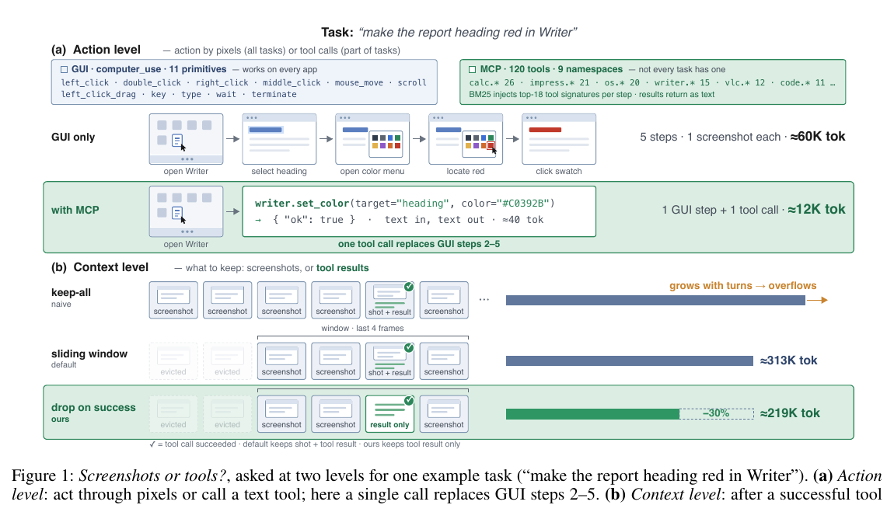

# Tool Availability Does Not Mean Tool Adoption

Language: English; [中文版本](2608.03327.md)

> Primary: [`CU`](https://github.com/legendtkl/agent-paper-daily/blob/main/docs/categories.en.md#cu); secondary: [`TU`](https://github.com/legendtkl/agent-paper-daily/blob/main/docs/categories.en.md#tu), [`SY`](https://github.com/legendtkl/agent-paper-daily/blob/main/docs/categories.en.md#sy), [`AT`](https://github.com/legendtkl/agent-paper-daily/blob/main/docs/categories.en.md#at)

## Metadata

- Original title: Screenshots or Tools? Eliciting Tool Use and Managing Multimodal Context in Hybrid GUI-MCP Computer-Use Agents
- Authors and affiliations: Siqi Fan, Minghao Li, Xiaoqian Ma, Wenhui Tan, Xiusheng Huang, Juntong Wu, Liujie Zhang, Shuo Shang, Weihang Chen; UESTC, Xiaohongshu AI Platform, Renmin University of China, and Peking University
- arXiv: <https://arxiv.org/abs/2608.03327>; PDF: <https://arxiv.org/pdf/2608.03327>
- Code, data, and project: no paper-specific repository found; experiments use public OSWorld-MCP
- Version and dates: v1; first submitted and last revised 2026-08-04 08:35:51 UTC; researched 2026-08-06
- Popularity evidence: Hugging Face API returned 404, no paper-specific GitHub repository was found, and Hacker News had no exact match; collected 2026-08-06 09:03-09:12 Asia/Shanghai

## Conclusion summary

- Under one GUI-MCP harness, the same tools improve a reasoning checkpoint by 4.0 points and hurt a non-reasoning checkpoint by 5.9 points, using five-run means on 309 tasks with both differences beyond two standard errors.
- The benefiting model still calls a tool on only 55/309 tasks, or 23.9% of 230 tool-reachable tasks. The paper names this under-use the adoption gap.
- A dense tool bonus moves spreadsheet adoption from 0.03 to 0.33 and survives greedy decoding, but it produces no sustained held-out fail-to-pass flips. Tool choice and tool competence are distinct.
- Halving image history and dropping a redundant post-tool screenshot reduces input cost to roughly 53%. Inference-only compression loses 3.9 points; matched-observation training recovers the loss and reaches 37.8% versus a 33.0% rich baseline.
- Score: 87/100. The study is directly useful for hybrid GUI-tool agents, but it lacks paper-specific code, training traces, and cross-OS evidence.

## Research question and background

Computer-use agents can act through universal but expensive pixels or precise and cheap text tools. Exposing tool signatures does not settle when to call them, how to fill arguments, how to consume results, or when visual confirmation remains necessary. The paper separates an action-level choice between screenshots and tools from a context-level choice between retaining screenshots and relying on tool results.

## Method

The OSWorld-MCP setup combines 11 GUI primitives with 120 MCP tools across nine namespaces and injects the top 18 tool signatures by BM25 at each step. Static experiments hold the harness fixed and swap Thinking and Instruct checkpoints. Context compression varies a four- versus two-frame window and whether the post-success screenshot is dropped.

Multi-turn GRPO uses 74 gradient-band tasks, eight trajectories per task, and a 50-step horizon. A dense bonus applies only to the first execution-successful, non-read-only call for each tool-argument key. A second intervention trains with the same compressed observation policy used at deployment.

Figure 1, paper page 2, original title “Screenshots or tools?” It explains how one tool call can replace several GUI steps and how a redundant screenshot can be removed. Its token counts are illustrative; Table 2 provides the measured costs.

## Experiments and evidence

Thinking improves from 30.5% GUI-only accuracy to 34.5% with MCP, while Instruct falls from 25.4% to 19.5%. Thinking adopts tools on 55/309 tasks and Instruct on 32/309; Instruct also emits 97 hallucinated tool names and false-terminates on 102/309 tasks.

Thinking's window-4 setup averages 337.1K input tokens per task; window-2+drop uses 219.5K. Inference-only compression costs 3.9±1.0 points, concentrated in a pre-registered 13-task degraded subset.

The dense tool bonus raises spreadsheet adoption from 0.03 to 0.33 and greedy adoption from 0.02 to 0.29, but yields no sustained fail-to-pass flips across 48 held-out tasks. Matched compression training reaches 37.8% across all 309 tasks at roughly 53% of rich input cost, yet held-out accuracy remains unchanged.

## Limitations and risks

The authors note that Thinking and Instruct differ in more than a reasoning trace, so the study does not prove that reasoning capability generally determines the sign of tool injection. The RL probe changes decisions but does not solve tool semantics. Compression recovery does not transfer to held-out tasks, the rule is fixed rather than learned, and cross-OS scaling is unevaluated.

No paper-specific code or trajectories were found. Execution success can differ from semantic success: a zero-replacement edit may report success, causing screenshot removal to discard the only visual error signal. The checkpoint comparison covers one model family.

## Reproduction and application

Exact reproduction requires OSWorld-MCP VMs, 120 MCP tools, BM25 injection, both checkpoints, five repeated runs on 309 tasks, and GRPO across 96 parallel environments. The appendix specifies many settings, but absent code and a license keep reproducibility moderate.

Practical takeaways are to report tool reachability separately from adoption, verify semantic effects rather than transport success, and drop screenshots only when tool results establish the required state. Tool-call rate alone is not a valid optimization target.

## Related work

- [OSWorld](https://arxiv.org/abs/2404.07972) supplies the general desktop environment.
- [OSWorld-MCP](https://arxiv.org/abs/2510.24563) adds verified MCP tools; this paper studies adoption and cost above it.
- [ToolCUA](https://arxiv.org/abs/2605.12481) trains GUI-tool routing; this work separates route choice from call competence.
- [MCPWorld](https://arxiv.org/abs/2506.07672) unifies API, GUI, and hybrid evaluation.
- [Context as a Tool](https://arxiv.org/abs/2512.22087) makes context management callable; this paper uses fixed visual retention rules.

## Community response

No verifiable third-party review was found. The Hugging Face paper endpoint returned 404, no dedicated GitHub repository appeared, and exact Hacker News and public X searches found no relevant discussion. All six specified Reddit communities returned HTTP 403, an access gap rather than evidence of no discussion. The visible evidence is therefore author-controlled and single-system biased.

## Research judgment

Reading priority: high. Confidence: medium-high. Best suited to computer-use, MCP tooling, agent-training, and inference-cost teams.

Weighted score: 87/100. Agent relevance 5.0/5, contribution 4.5/5, evidence 5.0/5, reproducibility 3.0/5, freshness 5.0/5, and verifiable attention 0.5/5. The 309-task, five-run diagnostics and training probes are strong; absent code, missing held-out gains, incomplete causal attribution, and no third-party response are the main deductions.

Watch for a code and trajectory release, a within-model thinking toggle, semantic supervision that converts adoption into held-out accuracy, and stronger validation before screenshot removal.

## Sources

- arXiv: <https://arxiv.org/abs/2608.03327>
- PDF: <https://arxiv.org/pdf/2608.03327>
- OSWorld-MCP: <https://arxiv.org/abs/2510.24563>
- Hugging Face: <https://huggingface.co/papers/2608.03327>
- Hacker News: <https://hn.algolia.com/?q=2608.03327>
- Reddit search: <https://www.reddit.com/search/?q=%222608.03327%22>
- Public X search: <https://x.com/search?q=%222608.03327%22&src=typed_query>
