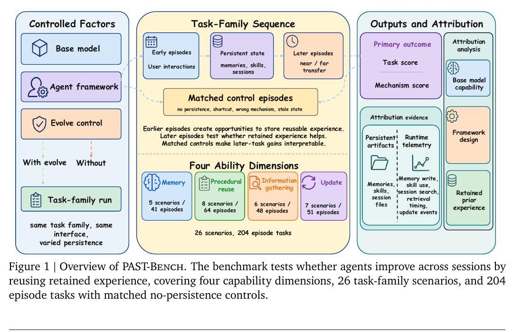

# 持久化经验是否真的让 Agent 进步

语言：中文；[English companion](2608.04003.en.md)

> 主分类：[`EV`](https://github.com/legendtkl/agent-paper-daily/blob/main/docs/categories.md#ev)；辅助分类：[`LT`](https://github.com/legendtkl/agent-paper-daily/blob/main/docs/categories.md#lt)、[`KM`](https://github.com/legendtkl/agent-paper-daily/blob/main/docs/categories.md#km)、[`AF`](https://github.com/legendtkl/agent-paper-daily/blob/main/docs/categories.md#af)

## 元数据

- 英文标题：PAST-Bench: Benchmarking the Foundations of Recursive Self-Improvement in Personal Agents
- 作者与机构：Shuhan Xue、Zixin Ding、Yichen Shen、Yinjie Wang、Zhenfei Yin、Yingcheng Wu、Yuxin Chen、Mengdi Wang、Ling Yang；论文首页标注 Princeton University
- arXiv：<https://arxiv.org/abs/2608.04003>；PDF：<https://arxiv.org/pdf/2608.04003>
- 代码与数据：<https://github.com/Gen-Verse/PAST-Bench>；Apache-2.0
- arXiv 分类：cs.CL；内部分类：主分类 `EV`，辅助分类 `LT`、`KM`、`AF`
- 版本与时间：v1；首次提交与最近修订均为 2026-08-04 17:58:05 UTC
- 调研日期与复查日期：2026-08-06
- 热度证据：Hugging Face Daily Papers 28 票；GitHub 6 stars、2 forks、1 个 issue。采集时间为 2026-08-06 09:03～09:12（Asia/Shanghai）
- 社区评价来源：Hugging Face、Hacker News Algolia、六个指定 Reddit 社区、GitHub issues 和公开 X 搜索；采集时间为 2026-08-06 09:03～09:12（Asia/Shanghai）

## 结论摘要

- PAST-Bench 不只问跨会话分数是否提高，还检查提高是否经过预期的保存、检索与更新路径。它包含 26 个任务族、204 个新会话 episode，覆盖记忆、过程复用、信息检索和状态更新。
- 固定 Hermes 时，7 个基础模型的持久化收益均为正，但能力分布差异很大；固定 MiniMax-M2.7 时，4 个 Agent 框架的总体变化从 −0.08 到 +0.13，说明「有记忆」不能推导出稳定进步。
- Hermes+ 根据失败轨迹加入 Plan、Render、Route、Gate、Close 五个机制。总体持久化开启分数仍为 0.66，但持久化差值从 +0.13 提高到 +0.15，机制证据从 0.64 提高到 0.73；Update 差值从 +0.12 提高到 +0.24，Procedural 却从 +0.05 退化到 −0.02。
- 改进有明显成本：MiniMax-M2.7 下 Hermes+ 平均每 episode 使用 31,859 token，是 Hermes 12,615 的约 2.5 倍；墙钟时间只增加约 1.10 倍。
- 综合评分为 91/100。它为持续学习 Agent 提供了比单次成功率更可信的评测设计，但任务主要是合成且隔离的，机制分数仍是路径一致性证据，不是因果必要性证明。

## 研究问题与背景

个人 Agent 会跨会话保存偏好、任务历史、工具流程和 Skill。现有评测通常比较有无记忆后的最终分数，却难以回答提升是否真的来自持久化状态，也无法区分模型能力、框架设计和错误捷径。PAST-Bench 将「进步」定义为：早期 episode 产生可复用经验，后续新会话在匹配控制下因访问该经验而改善，并留下与预期机制一致的产物和运行轨迹。

## 核心方法

每个任务族包含有持久化与无持久化的配对运行；模型、Agent、提示、工具、上下文窗口、输出限制和压缩策略保持不变，只有早期状态是否可访问发生变化。26 个任务族拆为记忆 5 个、过程复用 8 个、信息检索 6 个、更新 7 个，共 204 个 episode。主结果同时报告任务分数差值与机制证据分数。

Hermes+ 将五类失败映射到五个运行时插入点：Plan 在计划前要求查询相关状态；Render 用带类型、范围、实体、有效期和替代关系的绑定呈现记忆；Route 把流程保存为可排名、可修补的 Skill；Gate 在依赖历史状态的动作前强制检索；Close 在 episode 结束时同步覆盖旧状态并刷新持久化存储。

图 1，论文第 1 页，原题「Overview of PAST-Bench」。它支持「任务分数与机制归因同时评测」的设计说明；是否建立因果关系仍取决于配对控制、反事实干预和人工验证。

## 实验与证据

**跨模型。** 固定 Hermes 后，GLM-5.1 的总体差值为 +0.20，Kimi K2.6 为 +0.17；论文覆盖 7 个基础模型，所有模型都从持久化获得正向总体收益，但最受益的能力不同。

**跨框架。** 固定 MiniMax-M2.7 后，nanobot、ZeroClaw、Agent-Zero、Hermes 的总体差值分别为 +0.13、+0.12、−0.08、+0.13；机制证据分别为 0.57、0.55、0.39、0.64。同一总体收益可对应完全不同的保存—检索路径。

**消融。** 单机制实验中，Render 给出最高记忆分数 0.80，Route 给出最大单机制 Procedural 差值 +0.10，Gate 给出最大信息检索差值 +0.17，Close 给出最大 Update 差值 +0.16。完整 Hermes+ 将总体差值从 +0.13 提高到 +0.15，机制证据从 0.64 提高到 0.73，但 Procedural 退化到 −0.02，表明机制组合不是简单相加。

**泛化与方差。** Hermes+ 在 5 个基础模型中的 3 个提高或保持基线；DeepSeek-V4-Pro 与 Claude Opus 4.6 略有回退。Hermes 与 Hermes+ 在 MiniMax-M2.7 下各有 3 次独立运行，总体差值分别为 0.13±0.04 与 0.15±0.06；两者 0.02 的差异小于跨运行波动，Hermes+ 更适合被视为诊断脚手架而非已证明的统一改进。

## 局限与风险

**作者明确披露。** 任务族是合成并隔离的，没有覆盖更长序列、跨任务族干扰、真实用户交互或更强形式的递归自改进。机制分数检查与预期路径的一致性，而不是因果必要性；需要删除、替换或污染候选产物的反事实实验。Hermes+ 的效果依赖模型和能力，不能假定五个机制可统一组合。

**调研推断。** 「recursive self-improvement」在本文中主要指持久化状态带来的后续表现改善，不涉及 Agent 修改模型权重或改写自身学习算法，标题可能使能力边界看起来更强。开放式评分使用 MiniMax-M2.7 judge；虽然论文包含人工验证和敏感性分析，模型裁判仍可能与被测模型共享偏差。3 次重复运行只覆盖两个 MiniMax 配置，其他跨模型结果的方差边界更弱。

## 复现与应用

Apache-2.0 仓库提供 Python 3.11+ 包、Docker 沙箱、26 个任务族、Hermes/Hermes+/nanobot/ZeroClaw/Agent-Zero 适配器、配置、Mock 服务和测试。完整运行需要 Docker、模型 API、MiniMax-M2.7 judge，以及相应 Agent 框架。仓库当前有 6 stars、2 forks；issue #1 计划发布 Hugging Face 数据集，说明数据分发仍在完善。

应用上，PAST-Bench 最有价值的不是单一排行榜，而是三条检查：后续提升是否在新会话发生；所需状态是否真的写入并在正确时机读取；更新后旧状态是否被替代而非并存。Hermes+ 的检索门控与同步 closeout 可迁移到个人助理、Coding Agent 和长期研究 Agent，但需要明确 token 成本与过度检索风险。

## 相关工作

- [MemGPT（arXiv:2310.08560）](https://arxiv.org/abs/2310.08560)：把记忆管理类比为操作系统；PAST-Bench评测其跨会话效用与路径证据。
- [SkillsBench（arXiv:2602.12670）](https://arxiv.org/abs/2602.12670)：评测静态 Skill 的任务收益；本文关注经验在序列中被保存、检索和更新。
- [Recursive Harness Self-Improvement（arXiv:2607.15524）](https://arxiv.org/abs/2607.15524)：让 Harness 迭代改进；PAST-Bench 提供配对控制和机制归因。
- [PATH-Bench（arXiv:2608.01149）](https://arxiv.org/abs/2608.01149)：评测经验路径、迁移与遗忘；本文更强调新会话中的持久化开关与机制证据。
- [ContinualSkillBench（arXiv:2608.03874）](https://arxiv.org/abs/2608.03874)：比较独立执行、纯 ICL 与显式 Skill 维护；与本文共同质疑「Skill 数量增长即能力增长」。

## 社区评价

未检索到可核验的第三方社区评价。Hugging Face Daily Papers 显示 28 票，反映早期注意力但没有可核验评论；GitHub 的 6 stars、2 forks 和一个数据发布 issue 均来自项目上线初期，不能证明独立复现。Hacker News 与公开 X 没有精确讨论命中。

六个指定 Reddit 社区均返回 HTTP 403，属于访问缺口。当前可见讨论样本由作者页面和代码仓库主导，平台、语言与发布时间偏差明显。

## 调研判断

阅读优先级：高。可信度：高于多数持续记忆基准，但仍为中高。适合 Agent 评测、长期记忆、自我改进和个人助理团队。

加权评分为 91/100：Agent 相关性 5.0/5、研究贡献 4.5/5、实验证据 4.5/5、可复现性 4.5/5、新鲜度 5.0/5、可验证关注度 2.0/5。配对控制、跨模型／框架比较、机制消融、成本与开放代码构成主要加分；合成任务、机制归因非因果、跨模型方差不足和早期社区证据有限是主要扣分。

后续应观察：Hugging Face 数据发布；第三方是否能复现机制分数；更长序列与跨任务族干扰；用反事实删除／污染产物验证因果必要性；Hermes+ 的 2.5 倍 token 成本能否下降。

## 来源

- arXiv：<https://arxiv.org/abs/2608.04003>
- PDF：<https://arxiv.org/pdf/2608.04003>
- 官方代码与数据：<https://github.com/Gen-Verse/PAST-Bench>
- Hugging Face Daily Papers：<https://huggingface.co/papers/2608.04003>
- GitHub 数据发布 issue：<https://github.com/Gen-Verse/PAST-Bench/issues/1>
- Hacker News 精确检索：<https://hn.algolia.com/?q=2608.04003>
- Reddit 搜索入口：<https://www.reddit.com/search/?q=%222608.04003%22>
- 公开 X 搜索入口：<https://x.com/search?q=%222608.04003%22&src=typed_query>
