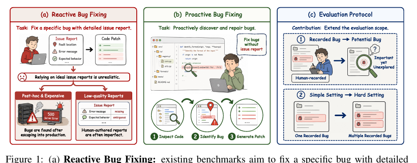

# Can Coding Agents Fix Bugs Without Issue Reports?

Language: English; [中文版本](2608.04682.md)

> Primary: [`EV`](https://github.com/legendtkl/agent-paper-daily/blob/main/docs/categories.en.md#ev); secondary: [`SE`](https://github.com/legendtkl/agent-paper-daily/blob/main/docs/categories.en.md#se)

## Metadata

- Original title: Active-SWE: Benchmarking Coding Agents for Proactive Bug Fixing without Issue Reports
- Authors and affiliations: Haobin Li, Ping Deng, Weizhong Qian, Liang Jiang, Zhenyu Huang, Mouxing Yang, Xi Peng; Sichuan University, University of Electronic Science and Technology of China, and independent researchers
- arXiv: <https://arxiv.org/abs/2608.04682>; PDF: <https://arxiv.org/pdf/2608.04682>
- Code, data, and project: <https://github.com/XLearning-SCU/Active-SWE>; <https://huggingface.co/datasets/XLearning-SCU/Active-SWE>; <https://hbinli.github.io/Active-SWE/>
- Licenses: the repository declares Apache-2.0; the arXiv PDF declares CC BY 4.0
- Version and dates: v1; first submitted and last revised 2026-08-05 10:50:01 UTC; researched and reviewed 2026-08-07
- Popularity evidence: 0 Hugging Face paper upvotes; 86 linked-dataset downloads and 3 likes; 3 GitHub stars, 0 forks, and 0 issues; collected 2026-08-07 09:01-09:34 Asia/Shanghai

## Conclusion summary

- Active-SWE shifts coding-agent evaluation from fixing one known issue to inspecting a repository, finding bugs, and producing repairs without an instance-specific issue report. The curated suite has 400 tasks; Active-SWE-Extend has 1,663 tasks across six bug classes and eight languages.
- Recorded bugs are checked with reference tests. For potential bugs, the agent must generate a fail-to-pass test for every claimed repair, and a judge checks whether each test supports the claimed bug.
- Under one Claude Code harness, the best recorded-bug resolution rate is 20.0%. On a matched subset, removing issue reports drops Claude Opus 4.8, GPT-5.5, and GLM-5.2 from 59.0%, 57.0%, and 58.0% to 26.0%, 22.0%, and 17.0%.
- Localization is associated with resolution but is insufficient. The three models localize 32.8%, 30.8%, and 9.8% of recorded bugs, while resolving 18.2%, 15.8%, and 10.4%.
- Score: 90/100. The benchmark materially expands the evaluated capability boundary, but historical-PR contamination, model-judge dependence, and missing run-to-run uncertainty constrain the claim.

## Research question and background

SWE-bench-style tasks assume a human issue report that identifies symptoms, expected behavior, or useful context. Real repositories contain defects that have not yet been reported, and reports may be incomplete. A proactive agent must decide what to inspect, localize one or more defects, propose repairs, and validate those repairs without task-specific hints.

## Method

The pipeline starts from merged GitHub pull requests with an issue, reference patch, and reference tests. Three model annotators assign bug taxonomies, an automated setup agent builds Docker environments and test scripts, and difficulty-aware grouping creates simple single-bug and hard multi-bug tasks. The extended suite contains 1,411 simple and 252 hard tasks; the 400-task main suite samples 300 and 100.

The recorded track reports localization recall, localization precision, and reference-test resolution. The potential track asks the evaluated agent to generate one test per claimed bug. Tests must fail before and pass after the patch. A Qwen3.5-397B judge links bugs to tests, and `Revealed` succeeds only if every test is valid and every claimed bug has evidence.

Figure 1, paper page 2. It contrasts reactive and proactive bug fixing and shows the two evaluation extensions: recorded to potential bugs, and single to multiple bugs. It does not depict data provenance, judge dependence, or contamination risk.

## Experiments and evidence

The extended set spans Python, Go, Rust, PHP, Ruby, JavaScript/TypeScript, Java, and C/C++. Median repositories contain 193K lines and 910 files for simple tasks and 353K lines and 926 files for hard tasks. Median reference patches edit 12 versus 19 lines.

Seventeen closed and open models are compared under the same Claude Code harness. Recorded-bug resolution reaches 20.0% for Claude Opus 4.8, 18.5% for GPT-5.5, and 13.0% for GLM-5.2. Potential-bug `Revealed` is 75.0%, 65.5%, and 69.0%, but this measures whether self-proposed bugs have generated-test and judge support, not recall over unknown defects.

On a matched reactive/proactive subset, removing issue reports cuts resolution by 33.0-41.0 points. Agents spend more early turns inspecting code before moving to search and execution. Exception Safety is easier than State & Lifecycle, and discovered potential bugs concentrate in Logic & Computation and Reference & Data Flow.

Average per-instance cost ranges from $0.54 for Qwen3.5-35B to $32.33 for Claude Opus 4.8. The paper does not report wall-clock latency, a full token breakdown, repeated-run variance, or significance tests.

## Limitations and risks

The authors scope future work to vulnerability discovery and security auditing; the current suite focuses on general bug repair. Only 400 of 1,663 tasks form the curated main evaluation. Potential-bug validity depends partly on a Qwen3.5-397B semantic judge.

The tasks derive from public historical pull requests, so models may have seen related code, tests, or patches during training. Removing the issue report does not remove contamination. `Revealed` validates evidence for claimed bugs but does not measure recall over all latent bugs and may reject semantic defects that are difficult to encode as tests. A fixed Claude Code harness means rankings describe model-harness configurations. The paper reports no human-agreement study for the potential-bug judge and no multi-seed statistical analysis.

## Reproduction and application

The Apache-2.0 repository provides a Python package, Docker execution, both suites, a three-stage runner, metrics, and setup skills for Claude Code and Codex. The Hugging Face dataset exposes 2,063 Parquet rows; the default evaluation uses the 400-row main split. Recorded and Potential stages run in network-restricted containers with a fixed model bridge; Judge runs on the host network.

A full run needs Docker storage, provider credentials, and can take hours. A ten-task preflight is the practical entry point. The benchmark suits proactive code review, regression-test generation, and repository-maintenance agents, but does not certify autonomous production patching.

## Related work

- [SWE-bench](https://arxiv.org/abs/2310.06770) mines issue-PR pairs for known-problem repair; Active-SWE removes instance-level issues and adds potential-bug evaluation.
- [SWE-bench Pro](https://arxiv.org/abs/2509.16941) stresses long-horizon issue resolution; Active-SWE changes the task entry point to proactive discovery.
- [TestExplora](https://arxiv.org/abs/2602.10471) evaluates repository-level test generation for proactive discovery; Active-SWE jointly requires patches, fail-to-pass tests, and multi-bug handling.
- [SWE-Atlas](https://arxiv.org/abs/2605.08366) broadens coding-agent evaluation beyond issue resolution; Active-SWE specializes in no-issue bug discovery.
- [DeepSWE](https://arxiv.org/abs/2607.07946) uses original tasks and handwritten verifiers to reduce contamination and verifier defects, directly highlighting Active-SWE's main evidence boundary.

## Community response

No verifiable third-party review was found. Hugging Face shows 0 paper upvotes; the linked dataset has 86 downloads and 3 likes. GitHub shows 3 stars, 0 forks, and 0 issues. These are early access signals, not independent reproduction. Hacker News had no exact title or arXiv-ID match, and public X search found no verifiable third-party post.

All six specified Reddit communities returned HTTP 403, an access gap rather than evidence of no discussion. The project page and Chinese introduction are author-controlled and are not treated as third-party response. Interaction counts measure attention, not quality.

## Research judgment

Reading priority: high. Confidence: medium-high. Best suited to coding-agent, software-engineering evaluation, code-review, and agent-infrastructure teams.

Weighted score: 90/100. Agent relevance 5.0/5, contribution 4.5/5, evidence 4.5/5, reproducibility 4.5/5, freshness 5.0/5, and verifiable attention 1.0/5. Large real-repository tasks, dual-track executable verification, strong baselines, cost analysis, and open code are strengths. Historical-PR contamination, model judging, absent variance, and missing third-party response are the main deductions.

This is rolling-window paper ten and clears the >=85 exception threshold. Its proactive-maintenance contribution does not duplicate yesterday's tool-adoption or persistent-memory evaluations. Skill-Use and Canary Tools remain watchlisted because the rolling window is full.

Watch for third-party reproduction of the 400-task leaderboard, human agreement on potential-bug judging, original or time-isolated tasks, cross-harness ranking stability, and cost and latency for continuous repository scanning.

## Sources

- arXiv: <https://arxiv.org/abs/2608.04682>
- PDF: <https://arxiv.org/pdf/2608.04682>
- Official code: <https://github.com/XLearning-SCU/Active-SWE>
- Official data: <https://huggingface.co/datasets/XLearning-SCU/Active-SWE>
- Official project page: <https://hbinli.github.io/Active-SWE/>
- Hugging Face Daily Papers: <https://huggingface.co/papers/2608.04682>
- Hacker News exact search: <https://hn.algolia.com/?q=2608.04682>
- Reddit search: <https://www.reddit.com/search/?q=%222608.04682%22>
- Public X search: <https://x.com/search?q=%222608.04682%22&src=typed_query>
