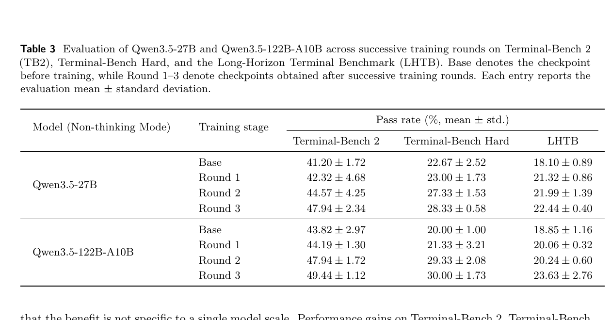

# Recursively Synthesizing Verifiable Long-Horizon Terminal Tasks

Language: English; [中文版本](2608.05466.md)

> Primary: [`EV`](https://github.com/legendtkl/agent-paper-daily/blob/main/docs/categories.en.md#ev); secondary: [`SE`](https://github.com/legendtkl/agent-paper-daily/blob/main/docs/categories.en.md#se), [`AT`](https://github.com/legendtkl/agent-paper-daily/blob/main/docs/categories.en.md#at), [`SY`](https://github.com/legendtkl/agent-paper-daily/blob/main/docs/categories.en.md#sy)

## Metadata

- Original title: Recursive Synthesis for Long-Horizon Terminal Tasks
- Authors: Zhongzhi Li, Yucheng Shi, Zongxia Li, Ruhan Wang, Anhao Li, Zixun Huang, Junyao Yang, Lei Ke, Ninghao Liu, Haitao Mi, and Leowei Liang
- Affiliations: Tencent HY LLM Frontier, University of Georgia, University of Maryland College Park, University of Pennsylvania, University of Minnesota Twin Cities, Indiana University, National University of Singapore, and Hong Kong Polytechnic University
- arXiv: <https://arxiv.org/abs/2608.05466>; PDF: <https://arxiv.org/pdf/2608.05466>
- Project: <https://zhongzhi660.github.io/recursive-verified-synthesis-site/>; Hugging Face collection: <https://huggingface.co/collections/Zhongzhi1228/recursive-task-synthesis>
- Code, data, and license: no downloadable code or dataset was public at collection time; license not verified
- Version: v2; first submitted 2026-08-05 23:24:26 UTC; revised 2026-08-07 02:05:23 UTC; announced as a replacement in the 2026-08-10 batch
- Research and review date: 2026-08-11
- Popularity evidence: 228 Hugging Face Daily Papers upvotes; collected 2026-08-11 09:05-09:25 Asia/Shanghai

## Conclusion summary

- The paper turns terminal-task synthesis into a recursive loop: extend the reference solution first, then realign the verifier and public instruction. Fifteen rounds grow 639 verified TerminalWorld seeds into 37,484 sandbox-validated tasks.
- Median solution length rises from 67 to 374 lines and command count from 40 to 244. DeepSeek-V4-Pro pass@4 falls from 90% at round 1 to 2.5% at round 15.
- SFT and RL on the synthesized tasks improve Terminal-Bench 2, Terminal-Bench Hard, and LHTB, so the contribution is not merely harder evaluation data.
- Evidence is strong but reproducibility is incomplete: tasks, code, full compute, and total cost are not public, and both training and evaluation remain in the terminal-task family.
- The conclusion conflicts with Table 4 on the RL Terminal-Bench 2 number. This review uses 49.44 and +20.00%, which agree between the abstract and table, and flags 46.07 and +11.82% in the conclusion as unresolved.

## Research question and background

Long-horizon terminal agents lack executable, verifiable, controllably difficult training tasks. Rewriting instructions alone can break verifier alignment, while adding steps can create verbosity instead of real difficulty. The paper asks whether a small verified seed set can recursively evolve tasks, reference solutions, and verifiers together, then serve as SFT and RL data.

## Method

Each round selects verified tasks, applies 40 operators to extend the reference solution, and rewrites the verifier and public instruction to match. Operators cover goal extension, constraint strengthening, environment perturbation, dependency introduction, and multi-stage composition. Domain and operator quotas preserve diversity.

Candidates run in fresh Daytona sandboxes. The pipeline checks reference-solution execution and terminal verification, performs bounded repair, and only admits verified children as future seeds. Unlike instruction-only synthesis, solution and verifier evolve together; unlike static benchmark expansion, accepted children recursively form a curriculum.

## Experiments and evidence

Fifteen rounds produce 37,484 tasks at about $0.05 per task, or $50 per thousand. Median solution lines increase 67→374 (5.6x), commands 40→244 (6.1x), while instruction length grows only 1.4x. DeepSeek-V4-Pro pass@4 drops 90%→2.5% and partial credit .970→.170.

For Qwen3.5-27B, SFT moves Terminal-Bench 2 / Hard / LHTB from 41.20±1.72 / 22.67±2.52 / 18.10±0.89 to 47.94±2.34 / 28.33±0.58 / 22.44±0.40. Qwen3.5-122B-A10B moves from 43.82±2.97 / 20.00±1.00 / 18.85±1.16 to 49.44±1.12 / 30.00±1.73 / 23.63±2.76.

RL moves Qwen3.5-27B from 41.20 / 22.67 / 18.10 to 49.44 / 32.00 / 22.07, relative gains of 20.00%, 41.16%, and 21.93%, averaged over three runs. Domain entropy remains stable and deeper-round ablations retain training benefit.

> Original Table 3, paper page 13. It supports gains across model scales and benchmarks, but does not resolve same-domain data dependence or missing public artifacts.

## Limitations and risks

The authors note that tasks remain terminal-centric, programmatic verifiers cover only checkable terminal states, recursive templates may accumulate bias, and difficulty proxies do not equal real-world value.

This review additionally notes that training and all three benchmarks share a terminal-agent domain, limiting transfer claims. Missing tasks, code, total compute, and exact difficulty-probe configuration impede audit. The Table 4/conclusion inconsistency weakens reporting quality without overturning the broader multi-table trend.

## Reproduction and application

Reproduction needs 639 seeds with solutions and verifiers, 40 transformation operators, scalable isolated sandboxes, a generator, bounded repair, and SFT/RL pipelines. The appendix reports RL on eight nodes with eight GPUs each for Qwen3.5-27B, but not total training time or cost. Likely applications include curriculum generation for coding, operations, and data-processing agents, plus verifier-task consistency testing.

## Related work

- [TerminalWorld](https://arxiv.org/abs/2605.22535) supplies the 639 verified seeds.
- [Long-Horizon Terminal Benchmark](https://arxiv.org/abs/2607.08964) evaluates long-horizon terminal ability and is one external benchmark here.
- [CLI-Universe](https://arxiv.org/abs/2606.22883) expands CLI environments; this paper instead recursively evolves verified tasks.
- [NexForge](https://arxiv.org/abs/2607.14186) also emphasizes consistency among software tasks, environments, and verifiers.
- [Terminal-Bench 2](https://arxiv.org/abs/2601.11868) is a primary evaluation benchmark.

## Community response

No verifiable third-party technical review was found. Hugging Face Daily Papers shows 228 upvotes, but visible comments are promotional summaries from authors or affiliates plus automated recommendations, not independent evaluation.

Exact Hacker News and public X searches found no match. Six specified Reddit communities returned HTTP 403, which is an access gap rather than evidence of no discussion. No official public GitHub repository was found. Engagement reflects attention within an English-language paper-aggregation community, not quality or consensus.

## Research judgment

Reading priority: high. Confidence: medium-high. Most relevant to agent-data engines, executable evaluation, RL environments, and terminal-agent teams.

Weighted score: 90/100. Agent relevance 5.0/5, contribution 4.6/5, evidence 4.5/5, reproducibility 3.3/5, freshness 5.0/5, and verifiable attention 4.0/5. The depth curve, cross-scale SFT, RL, and ablations reinforce one another; missing artifacts and inconsistent reporting are the main deductions.

As rolling-window paper eight, it clears the at-least-85 exception threshold. Its verified recursive task synthesis does not duplicate recent work on internal rehearsal, harness evaluation, or visual-tool auditing. Watch for artifact release, number correction, transfer to heterogeneous environments, verifier false positives, and human audits.

## Sources

- arXiv: <https://arxiv.org/abs/2608.05466>
- PDF: <https://arxiv.org/pdf/2608.05466>
- Project: <https://zhongzhi660.github.io/recursive-verified-synthesis-site/>
- Hugging Face: <https://huggingface.co/papers/2608.05466>
- Collection: <https://huggingface.co/collections/Zhongzhi1228/recursive-task-synthesis>
- Hacker News search: <https://hn.algolia.com/?q=%22Recursive%20Synthesis%20for%20Long-Horizon%20Terminal%20Tasks%22>
- Reddit search: <https://www.reddit.com/search/?q=%222608.05466%22>
- X search: <https://x.com/search?q=%222608.05466%22&src=typed_query>
