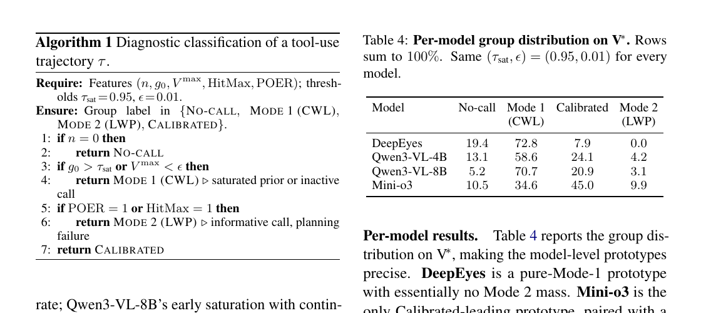

# Does Visual Tool Use Actually Use the Returned Evidence?

Language: English; [中文版本](2608.06270.md)

> Primary: [`EV`](https://github.com/legendtkl/agent-paper-daily/blob/main/docs/categories.en.md#ev); secondary: [`TU`](https://github.com/legendtkl/agent-paper-daily/blob/main/docs/categories.en.md#tu), [`MV`](https://github.com/legendtkl/agent-paper-daily/blob/main/docs/categories.en.md#mv)

## Metadata

- Original title: The Illusion of Visual Tool-Use: A Causal Audit of Thinking with Images
- Authors and affiliations: Zhiheng Wang, Bo Peng, Lai Wei, and Chaochao Lu; Shanghai Artificial Intelligence Laboratory, Shanghai Jiao Tong University, and Shanghai Innovation Institute
- arXiv: <https://arxiv.org/abs/2608.06270>; PDF: <https://arxiv.org/pdf/2608.06270>
- Code and project: <https://github.com/OpenCausaLab/CauAudit>; at collection time the repository contained only LICENSE and a 100-byte README, with no implementation, configurations, or run scripts
- Licenses: arXiv PDF CC BY 4.0; repository MIT, covering only its current contents
- Version and dates: v1; first submitted and last revised 2026-08-06 17:01:08 UTC; researched and reviewed 2026-08-08
- Popularity evidence: Hugging Face paper API returned 404; Hacker News has 1 point and 0 comments; GitHub has 0 stars, 0 forks, and 0 issues; collected 2026-08-08 09:02-09:18 Asia/Shanghai

## Conclusion summary

- The paper asks whether crop-and-zoom observations causally affect answers, not merely whether accuracy rises when tools are enabled. It intervenes at policy, trajectory, and individual-observation levels.
- Aggregate gains are not broad evidence use across six open models and five fine-grained benchmark families. DeepEyes scores 83.3% with and without tools on V*. Qwen3-VL-8B gains 6.9 points, yet 70.7% of its trajectories are classified as Calling Without Looking.
- Calling Without Looking means returned visual content does not affect the answer. Looking Without Planning means evidence is informative but call scheduling, stopping, or budget control fails. Calibrated trajectories are only 7.9% to 45.0% across four diagnosed models.
- Replacing every returned image with a same-shape random crop drops Mini-o3, Qwen3-VL-8B, and Qwen3-VL-4B by 64.2, 60.7, and 48.2 points on V*. Forced answering at the call limit still leaves gaps of 51.2, 18.1, and 16.8 points.
- Score: 87/100. Causal decomposition, multiple open models, seven benchmark partitions, repeated seeds, and appendix ablations are strong. Crop-and-zoom-only scope, white-box logits, model judging for some open responses, and a placeholder repository limit the claim.

## Research question and background

Thinking-with-images systems actively crop and zoom. Standard evaluation compares final accuracy but cannot distinguish genuine evidence gain, textual effects of emitting an action, and unnecessary calls made after the answer is already known.

The paper models image and question, tool actions, returned observations, and the final answer as a causal graph. It aims to separate action-induced shortcuts from information actually mediated by returned observations.

## Method

The policy-level intervention compares tool mode with direct inference under the same weights and decoding. The trajectory intervention replaces every observation online with a same-shape random crop, allowing subsequent actions to react to corrupted feedback. The step intervention fixes the prefix and action, swaps only the current observation, and computes Visual Evidence Gain from option logits so that the textual action effect cancels.

A deterministic classifier uses call count, pre-call confidence, maximum VEG, call-limit exhaustion, and post-saturation calling to label each rollout No-call, Mode 1 (CWL), Calibrated, or Mode 2 (LWP).

Table 4, paper page 8. Calibrated shares for DeepEyes, Qwen3-VL-4B, Qwen3-VL-8B, and Mini-o3 are 7.9%, 24.1%, 20.9%, and 45.0%; Mode 1 shares are 72.8%, 58.6%, 70.7%, and 34.6%. This V*-only table does not generalize by itself to other tools or closed models.

## Experiments and evidence

The study evaluates DeepEyes, Pixel Reasoner, Mini-o3, Qwen3-VL-4B/8B, and Thyme on V* (191), HR-Bench 4K/8K (800 each), VisualProbe Easy/Medium/Hard (515 total), and MME-RealWorld-Lite (1,919). It uses official checkpoints and decoding settings. Each model needs at least one H200; the main pipeline uses eight H200s and the judge another two.

DeepEyes has essentially no policy gain. Pixel Reasoner, Mini-o3, Qwen3-VL, and Thyme vary across tasks and sometimes regress. Mini-o3 gains 21.3 points on VisualProbe while still exhibiting many miscalibrated trajectories, so aggregate benefit is not per-call faithfulness.

Random-crop corruption barely affects DeepEyes and Thyme but sharply degrades Mini-o3 and Qwen3-VL while causing repair loops and call-limit exhaustion. Forced-answer ablations recover part of the score but remain well below clean trajectories, showing that missing evidence matters beyond truncation.

On V*, 81% of DeepEyes calls have |VEG| below 0.01, versus 29% for Mini-o3 and 56% for Qwen3-VL-8B. Qwen3-VL-8B averages VEG 0.55 on non-saturated calls and approximately zero on saturated calls. Each VEG averages three independent counterfactual crops, and corruption-choice, threshold, and repeated-seed checks preserve the main ordering.

The Calibrated group contributes +0.5, +3.5, +7.6, and +3.3 points of policy gain for DeepEyes, Qwen3-VL-4B, Qwen3-VL-8B, and Mini-o3. Other groups are near zero or offsetting. HR-Bench-4K reproduces the direction.

## Limitations and risks

The authors evaluate only open models. Policy- and trajectory-level tests can apply to black boxes, but step-level VEG requires token probabilities. Only crop-and-zoom is studied; OCR, segmentation, search, and video selection may behave differently. The outcome-only-RL explanation is a hypothesis, not a matched training experiment.

Direct inference changes the system prompt, so prompt differences and tool availability move together. Open-ended answers use a Qwen3-30B judge after exact matching, without a reported human-agreement study. The classifier depends on thresholds 0.95 and 0.01 despite sensitivity checks. The advertised repository currently contains only a license and tiny README, preventing reproduction of interventions and statistics.

## Reproduction and application

The paper specifies checkpoints, decoding parameters, call limits, benchmark sizes, corruption schemes, answer normalization, and judge configuration. Policy- and trajectory-level tests need only control over tool returns; VEG also needs logits.

The repository has no code at collection time. Full reproduction requires six multimodal checkpoints, seven benchmark partitions, at least eight H200-class GPUs, and two additional H200s for judging. A practical first test is trajectory corruption: replace tool returns with distribution-matched irrelevant content and measure answer changes, retries, and budget exhaustion.

## Related work

- [DeepEyes](https://arxiv.org/abs/2505.14362) trains crop-and-zoom behavior with RL; this audit finds many calls do not depend on returned content.
- [Pixel Reasoner](https://arxiv.org/abs/2505.15966) uses curiosity-driven pixel-space reasoning; this paper separates action and observation paths.
- [Mini-o3](https://arxiv.org/abs/2509.07969) scales visual-search turns; the audit finds informative observations alongside planning failures.
- [What Does Vision Tool-Use RL Really Learn?](https://arxiv.org/abs/2602.01334) separates tool-induced and intrinsic effects; this work adds step-level causal intervention.
- [TACO](https://arxiv.org/abs/2606.30251) provides process-level credit for tool use; VEG is a neighboring per-step diagnostic signal.

## Community response

No verifiable third-party technical commentary was found. The Hacker News submission has 1 point and 0 comments. Hugging Face's paper API returned 404. GitHub has 0 stars, 0 forks, 0 issues, and only an initial commit. These are low-attention signals, not quality judgments.

All six specified Reddit communities returned HTTP 403. Public X search had no exact match. The repository and arXiv abstract are release-party sources. Collected 2026-08-08 09:02-09:18 Asia/Shanghai.

## Research judgment

Reading priority: high. Confidence: medium-high. Best suited to visual-agent, tool-use evaluation, multimodal training, computer-use, and observability teams.

Weighted score: 87/100. Agent relevance 4.5/5, contribution 5.0/5, evidence 4.5/5, reproducibility 3.5/5, freshness 5.0/5, and verifiable attention 1.0/5. Three intervention levels, cross-model and cross-benchmark results, repeated seeds, and threshold and corruption ablations are strengths. Narrow tool scope, white-box requirements, model judging, compute cost, and the placeholder repository are the main deductions.

This is rolling-window paper nine and clears the >=85 exception threshold. It audits whether agents use returned evidence and does not duplicate HarnessOpt-Bench's system self-improvement evaluation.

Watch for complete code, OCR/segmentation/search/video replications, black-box trajectory results, process rewards that increase the Calibrated share, and third-party reproduction of VEG and forced-answer ablations.

## Sources

- arXiv: <https://arxiv.org/abs/2608.06270>
- PDF: <https://arxiv.org/pdf/2608.06270>
- Official repository: <https://github.com/OpenCausaLab/CauAudit>
- Hugging Face query: <https://huggingface.co/papers/2608.06270>
- Hacker News submission: <https://news.ycombinator.com/item?id=49208176>
- Hacker News exact search: <https://hn.algolia.com/?q=2608.06270>
- Reddit search: <https://www.reddit.com/search/?q=%222608.06270%22>
- Public X search: <https://x.com/search?q=%22The%20Illusion%20of%20Visual%20Tool-Use%22&src=typed_query>
