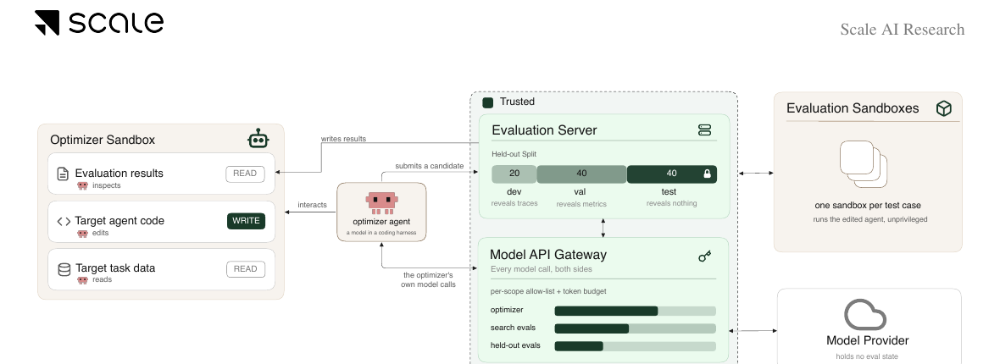

# 让 Agent 自动改进 Agent：Harness 优化如何评测

语言：中文；[English companion](2608.06301.en.md)

> 主分类：[`EV`](https://github.com/legendtkl/agent-paper-daily/blob/main/docs/categories.md#ev)；辅助分类：[`LT`](https://github.com/legendtkl/agent-paper-daily/blob/main/docs/categories.md#lt)、[`AF`](https://github.com/legendtkl/agent-paper-daily/blob/main/docs/categories.md#af)、[`SY`](https://github.com/legendtkl/agent-paper-daily/blob/main/docs/categories.md#sy)

## 元数据

- 英文标题：HarnessOpt-Bench: Evaluating LLMs at Harness Optimization
- 作者与机构：Varun Ursekar、Apaar Shanker、Yash Maurya、Shehab Yasser、Vijay S. Kalmath、Veronica Chatrath、Yuan Xue；Scale AI
- arXiv：<https://arxiv.org/abs/2608.06301>；PDF：<https://arxiv.org/pdf/2608.06301>
- 代码、数据与项目页：论文称随基准发布种子 Agent、数据切分、构建配置、评测 Harness 和运行产物，但截至采集时未找到可访问的官方代码仓库；机构入口为 <https://scale.com/research>
- 许可证：arXiv PDF 标注 CC BY 4.0；未验证独立代码许可证
- arXiv 分类：cs.AI、cs.CL、cs.LG；内部分类：主分类 `EV`，辅助分类 `LT`、`AF`、`SY`
- 版本与时间：v1；首次提交与最近修订均为 2026-08-06 17:21:05 UTC
- 调研日期与复查日期：2026-08-08
- 热度证据：Hugging Face Daily Papers 20 票；Hacker News 3 分、0 条评论；未找到官方 GitHub 仓库。采集时间为 2026-08-08 09:02～09:18（Asia/Shanghai）
- 社区评价来源：Hugging Face、Hacker News Algolia、六个指定 Reddit 社区、GitHub、公开 X 搜索、arXiv 与机构研究入口；采集时间为 2026-08-08 09:02～09:18（Asia/Shanghai）

## 结论摘要

- HarnessOpt-Bench 把「改 Agent 外壳」定义为受预算约束的随机程序优化：优化器可编辑提示词、工具、记忆与控制流，但不能改目标模型、环境和验证器，最终候选只在隐藏测试集上评一次。
- 基准覆盖 OfficeQA、BrowseComp-Plus、Terminal-Bench 和 GAIA，比较 5 个前沿模型、共享与原生 Coding Harness，共 111 个评分运行。每个候选在每道测试题上重复 3 次，每种优化器配置重复 2 轮。
- 固定任务与共享 Harness 后，更换优化器模型带来的平均增益变化为 0.142；固定任务与模型后，更换 Harness 的变化为 0.079。模型影响约为 Harness 影响的 1.8 倍，但原生 Harness 并不稳定优于共享 Harness。
- Claude Opus 5 在共享 opencode 下捕获 OfficeQA 63% 和 BrowseComp-Plus 48% 的可用提升空间；GPT-5.6-Sol 在 Codex 下对 GAIA 的原始隐藏测试分数为 0.49。多数中间配置差异小于运行噪声，不支持细粒度总排名。
- 加权评分 89/100。可信度来自隐藏测试、隔离执行、重复运行、预算计量和跨任务对照；主要限制是只覆盖 Python、每个任务只固定一个目标模型、优化器自身推理未设上限，以及论文所称复现包尚无可访问入口。

## 研究问题与背景

Agent 能力不只由模型权重决定，还由提示词、工具 Schema、上下文管理、重试、记忆和控制流共同决定。现有 Harness 优化工作常把优化器、目标 Agent、种子 Harness、评测预算和公开反馈混在一起，分数提升可能来自测试集泄露、评测器利用或更高计算预算，而不是可泛化的系统改进。

本文研究的是一个独立能力：给定固定目标模型、环境和验证器，前沿模型能否在有限评测预算内诊断并修改另一个 Agent 的 Harness，并在从未见过的隐藏测试集上实现真实提升。

## 核心方法

候选 Harness 是可执行 Python 代码库。优化器可增删文件，但不可修改目标模型、执行环境与验证器。数据按 20%/40%/40% 切分为开发、验证和测试：开发集公开样例、逐题结果和轨迹；验证集只公开聚合分数；测试集在搜索期间完全不可见。搜索预算包括每个公开分区最多 100 次评测、最多 4 次完整样例遍历，以及目标模型 token 上限。

最终指标是标准化增益：候选相对种子提升，占种子到满分剩余空间的比例。负值表示最终候选比种子更差。OfficeQA、BrowseComp-Plus 和 Terminal-Bench 从可工作但未经调优的种子开始；GAIA 从不可工作的 stub 开始，因此 GAIA 的增益就是隐藏测试原始分数。

Figure 1，论文第 2 页。优化器沙箱只能写目标 Agent 代码；开发轨迹、验证指标和隐藏测试由可信评测服务分级披露，所有模型调用经过白名单与预算网关。图中没有展示具体任务、统计分辨率和发布工件状态，不能替代实验表与复现附录。

## 实验与证据

**任务与规模。** OfficeQA、BrowseComp-Plus、Terminal-Bench、GAIA 的开发／验证／测试切分分别为 49/98/99、33/66/66、17/36/36、33/66/66。固定目标模型分别为 DeepSeek-V4-Flash、DeepSeek-V4-Flash、Grok-Build、GPT-5.4-mini。5 个优化器模型来自 Anthropic、OpenAI 和 Kimi；核心网格在共享 opencode 与各自原生 Harness 下形成 10 个配置。

**主要结果。** Claude Opus 5 整体领先：在 opencode 下，OfficeQA、BrowseComp-Plus、Terminal-Bench、GAIA 的标准化增益为 0.63、0.48、0.29、0.47。GPT-5.6-Sol 在 Codex 下为 0.49、0.03、0.12、0.49；换到 opencode 后为 0.29、0.09、0.13、0.31，说明 Harness 影响依模型和任务而变。

**测量边界。** 四个任务的分辨率带分别为 ±0.045、±0.066、±0.054、±0.035；小于该范围的差异只记为未分辨，不解释为显著排名。每个隐藏测试候选按题重复 3 次，各优化器配置重复 2 轮，附录报告观察区间而非只给单点。

**搜索行为。** 预注册的 8 类可改动项覆盖率与增益在四个任务上的 Spearman 相关系数为 +0.34～+0.88，但它与修改量相关，不能证明扩大搜索本身造成提升。完整轨迹只被 111 个评分单元中的 7 个配置调用 16 次；优化器主要依赖逐题摘要。中位配置只用 8 次评测调用，却消耗 82% 的样例遍历额度，说明真正约束搜索的是样例预算而非 API 调用次数。

**泛化与过拟合。** 多数最终隐藏测试分数低于搜索期间见到的最佳验证分数。论文因此证明隐藏测试必要，但没有区分选择性过拟合和验证／测试分布差异。

## 局限与风险

**作者明确披露。** 固定开发和验证反馈仍可能奖励针对评测器稳定特征的策略；种子 Harness 是任务先验，GAIA 的 stub 与其他成熟种子并不等价；候选只限 Python，每个任务只固定一个目标模型，无法外推到其他语言、运行时和架构。当前分辨率带是描述性阈值，不是正式显著性检验。

**调研推断。** 优化器自身推理 token 只计量、不封顶，因此结果不能直接比较固定总成本下的优化效率。四个任务和单一目标模型把「能改进此 Harness」与「能普遍改进 Agent」之间仍留有明显距离。论文声称已发布种子、切分、Harness 与运行产物，但 arXiv、GitHub 搜索和机构入口均未给出可访问的官方仓库；在工件真正上线前，复现性低于论文文字所暗示的水平。

## 复现与应用

论文给出较完整的复现设计：数据按不可变引用和提交清单固定，20/40/40 切分由脚本逐字节校验；候选为不可变 Git commit，依赖由 lockfile 固定；每次评测运行在临时沙箱中，模型网关记录输入、缓存、输出和总 token；所有过程分析都可从执行轨迹与评测记录重算。

但截至采集时未找到上述工件的公开下载入口，无法核对清单、锁文件、Trusted Gateway 或 111 个运行产物。完整复现还需要多家模型 API、4 类下游环境和大量重复评测，成本较高。工程团队可先借鉴三点：隐藏测试在最终候选前不可见；开发与验证反馈分级；模型调用和候选版本由外部网关计量与留痕。

## 相关工作

- [Meta-Harness（arXiv:2603.08640）](https://arxiv.org/abs/2603.08640)：用外层 Agent 搜索 Harness 代码；HarnessOpt-Bench 重点补上统一任务、预算、反馈和隐藏测试协议。
- [AFlow（arXiv:2410.10762）](https://arxiv.org/abs/2410.10762)：搜索代码化 Agent 工作流；本文不提出新搜索算法，而是评测优化器能力。
- [GEPA（OpenReview）](https://openreview.net/forum?id=RQm2KQTM5r)：以反思式提示演化优化系统；本文把提示词扩展为完整 Harness 代码并加入可信执行边界。
- [VERO（arXiv:2607.25886）](https://arxiv.org/abs/2607.25886)：把 Coding Agent 作为端到端 Harness 优化器；HarnessOpt-Bench 进一步固定跨模型、跨 Harness 的对照矩阵。
- [BenchJack（arXiv:2605.23950）](https://arxiv.org/abs/2605.23950)：审计 Agent 基准被评测器劫持的风险；本文用隐藏测试、不可修改验证器和沙箱隔离降低该风险。

## 社区评价

未检索到可核验的第三方技术评论。Hugging Face Daily Papers 显示 20 票；Hacker News 原始条目为 3 分、0 条评论。这些互动量说明论文获得早期关注，但不构成方法认可或独立复现。

六个指定 Reddit 社区均返回 HTTP 403，属于访问缺口；公开 X 搜索没有精确命中。GitHub 未找到官方仓库，只找到第三方页面对论文的二次引用。作者与机构页面属于发布方材料，不作为第三方评价。采集时间为 2026-08-08 09:02～09:18（Asia/Shanghai）。

## 调研判断

阅读优先级：高。可信度：中高。适合 Agent 评测、Harness 工程、Coding Agent、模型平台与自我改进系统团队。

加权评分为 89/100：Agent 相关性 5.0/5、研究贡献 4.5/5、实验证据 4.5/5、可复现性 3.5/5、新鲜度 5.0/5、可验证关注度 3.0/5。隐藏测试、可信执行、跨任务与跨 Harness 对照、重复运行和预算分析构成主要加分；公开工件缺口、任务与目标模型覆盖有限、优化器计算未封顶和缺少第三方评价是主要扣分。

本篇是滚动 7 天窗口第 8 篇，达到 85 分以上例外门槛；它测量「Agent 改进另一个 Agent 的 Harness」能力，与视觉工具调用的因果审计贡献不重复。

后续应观察：官方复现包是否真正开放；固定总 token 成本后的排名；跨目标模型和跨语言结果；对验证器、工具行为与样例做随机扰动后是否仍有增益；第三方能否重算 111 个运行单元。

## 来源

- arXiv：<https://arxiv.org/abs/2608.06301>
- PDF：<https://arxiv.org/pdf/2608.06301>
- 机构研究入口：<https://scale.com/research>
- Hugging Face Daily Papers：<https://huggingface.co/papers/2608.06301>
- Hacker News 原始条目：<https://news.ycombinator.com/item?id=49213543>
- Hacker News 精确检索：<https://hn.algolia.com/?q=HarnessOpt-Bench>
- Reddit 搜索入口：<https://www.reddit.com/search/?q=%222608.06301%22>
- 公开 X 搜索入口：<https://x.com/search?q=%22HarnessOpt-Bench%22&src=typed_query>
