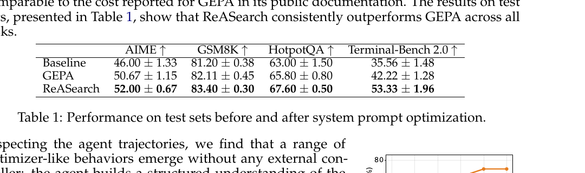

# 让 Agent 接管优化搜索策略

语言：中文；[English companion](2608.06714.en.md)

> 主分类：[`RP`](https://github.com/legendtkl/agent-paper-daily/blob/main/docs/categories.md#rp)；辅助分类：[`AF`](https://github.com/legendtkl/agent-paper-daily/blob/main/docs/categories.md#af)、[`LT`](https://github.com/legendtkl/agent-paper-daily/blob/main/docs/categories.md#lt)

## 元数据

- 英文标题：The Optimizer Is the Agent: Reasoning-Driven Search across Prompts, Programs, and ML Workflows
- 作者：Junbo Li、Boyi Liu、Canwen Xu、Yite Wang、Yuxiong He、Zhangyang Wang、Qiang Liu、Zhewei Yao
- 机构：University of Texas at Austin、Snowflake
- arXiv：<https://arxiv.org/abs/2608.06714>；PDF：<https://arxiv.org/pdf/2608.06714>
- 代码、数据、项目页与许可证：截至采集时未检索到官方公开工件
- 版本与时间：v1；首次提交与最近修订均为 2026-08-07 02:15:39 UTC；2026-08-10 批次新投稿；COLM 2026 conference paper
- 调研日期与复查日期：2026-08-11
- 热度证据：Hugging Face Daily Papers 4 票；采集时间 2026-08-11 09:05～09:25（Asia/Shanghai）
- 社区评价来源：Hugging Face、Hacker News、六个指定 Reddit 社区、GitHub、X 公开搜索和 arXiv；采集时间同上

## 结论摘要

- ReASearch 不再把优化策略固化为外部控制器，而让工具调用 Agent 自己决定生成候选、分配预算、验证、回滚与重启。
- 同一轻量框架覆盖提示优化、程序演化和机器学习工作流共 14 项任务，并在多数任务上优于固定搜索器或通用 Coding Agent。
- 提示优化中，ReASearch 在 AIME、GSM8K、HotpotQA、Terminal-Bench 2 上分别达到 52.00、83.40、67.60、53.33，均高于 GEPA。
- 证据覆盖广，但跨任务工具接口仍需人工设计；不少程序演化任务只有单个实例，强结果依赖 GPT-5 与 Claude Sonnet 4.6 等闭源模型。
- 代码和数据尚未公开，因此当前更像「统一搜索范式」的强概念与实验验证，而非可直接复现的通用优化器。

## 研究问题与背景

现有自动优化通常把搜索策略写在外部算法中：控制器规定变异、筛选、回滚和预算，语言模型只生成候选。不同对象——提示词、程序和训练工作流——往往需要不同优化器。论文询问能否让推理 Agent 同时承担候选生成和搜索控制，并在共享脚手架上迁移到多类优化问题。

## 核心方法

ReASearch 提供持久状态、候选工件、历史分数和领域工具，让 Agent 读取当前状态、提出修改、调用评测、解释结果并决定下一步。外部框架只负责预算和工具执行，不规定变异或选择策略。Agent 可以验证局部假设、撤销退化修改、从历史最佳点重启，并把经验写入记忆。

三类任务共享控制逻辑，但使用不同工具：提示优化编辑系统提示并在开发集评测；程序演化修改代码并执行测试；机器学习工作流调整训练配置、数据处理或模型代码。相较 GEPA、AdaEvolve 等专用算法，搜索策略由模型推理动态产生；相较 Claude Code 等通用 Coding Agent，它保留显式候选状态、聚合验证和优化记忆。

## 实验与证据

共 14 项任务、三类优化对象，每项进行三次独立运行并尽量匹配评测预算。提示优化完整一次运行在标准缓存下 API 成本低于 20 美元。

Baseline 在 AIME / GSM8K / HotpotQA / Terminal-Bench 2 上为 46.00±1.33 / 81.20±0.38 / 63.00±1.50 / 35.56±1.48；GEPA 为 50.67±1.15 / 82.11±0.45 / 65.80±0.80 / 42.22±1.28；ReASearch 为 52.00±0.67 / 83.40±0.30 / 67.60±0.50 / 53.33±1.96。

程序演化中，ARC-AGI-2 子集上使用 Claude Sonnet 4.6 的 ReASearch 测试正确率为 50.0%，AdaEvolve 为 12.5%；圆填充等任务上也能达到或超过部分人工最好结果。不过多项任务只有单个实例，容易放大偶然性。

机器学习工作流中，相对 Baseline / Claude Code，ReASearch 在 IMG-100 达 83.99±1.10（63.51±0.85 / 78.59±1.40），Atari 达 4500±320（475±90 / 1250±180），MuJoCo 达 5267±480（1537±220 / 3986±410），Crypto 达 0.1110±0.0024、排名第 6（0.0953、第 36 / 0.0999、第 29）。NanoGPT 上 ReASearch 0.976±0.008 与 Claude Code 0.974±0.010 接近，并非所有任务都显著领先。移除持久记忆或 Python 执行都会降低总体表现；聚合验证能减少单例反馈过拟合。

> 原文 Table 1，论文第 7 页。ReASearch 在四项任务上均高于 GEPA；结果来自三次独立运行，但仍依赖闭源 Agent 与学生模型。

## 局限与风险

**作者明确限制。** Agent 能力和成本决定搜索质量；不同领域仍需要设计工具与评测；优化可能过拟合有限验证集；复杂实验的失败恢复并非总是可靠。

**调研推断。** 「统一」主要发生在控制接口层，而非完全消除领域工程。14 项任务跨度大但样本量不均衡，多项程序任务是单实例；闭源模型、未公开提示和代码使外部复现暂不可行。跨任务使用不同指标，不能把平均提升直接解释为统一效应量。

## 复现与应用

复现需要持久候选存储、受控代码执行、预算记账、领域评测工具、聚合验证集，以及 GPT-5 或 Claude Sonnet 4.6 等论文所用模型。提示优化成本披露相对清楚，但程序和机器学习工作流的总算力与失败实验成本没有统一报告。适用于系统提示调优、算法代码搜索、AutoML、强化学习训练脚本和实验编排。

## 相关工作

- [GEPA](https://arxiv.org/abs/2507.19457)：使用反思式提示演化；本文把专用控制扩展为 Agent 自主控制。
- [AdaEvolve](https://arxiv.org/abs/2602.20133)：程序演化基线，本文在多项程序任务上比较。
- [AlphaEvolve](https://arxiv.org/abs/2506.13131)：展示语言模型驱动的算法发现，但仍依赖更明确的演化控制器。
- [DSPy](https://arxiv.org/abs/2310.03714)：把提示和模块编译成可优化程序；本文强调 Agent 自主搜索策略。
- [PromptBreeder](https://arxiv.org/abs/2309.16797)：同时优化提示与变异提示，是本文提示搜索方向的重要前序。

## 社区评价

未检索到可核验的第三方技术评价。Hugging Face Daily Papers 显示 4 票，尚无足以代表技术讨论的评论。Hacker News 精确标题与 URL 搜索未命中；GitHub 未找到官方公开仓库；X 公开搜索未命中；六个指定 Reddit 社区返回 HTTP 403，不能据此断言没有讨论。当前样本小且集中于英文论文聚合平台，不应被解释为质量共识。

## 调研判断

阅读优先级：高。可信度：中高。适合研究 Agent 自我改进、提示优化、程序搜索、AutoML 和实验自动化的读者。

加权评分 87/100：Agent 相关性 5.0/5、研究贡献 4.6/5、实验证据 4.5/5、可复现性 2.7/5、新鲜度 5.0/5、可验证关注度 3.0/5。跨三类任务与多组基线支持主张，但复现性、单实例任务和闭源依赖限制外推。

它作为滚动 7 天窗口第 9 篇，达到至少 85 分的放宽门槛；其 Agent 自主控制跨对象优化搜索，与 RST 的验证任务递归合成不重复。后续观察代码、完整提示和评测脚本发布；开源模型复现；领域工具设计成本；长时间搜索的预算效率、回滚可靠性和验证集泄漏。

## 来源

- arXiv：<https://arxiv.org/abs/2608.06714>
- PDF：<https://arxiv.org/pdf/2608.06714>
- Hugging Face：<https://huggingface.co/papers/2608.06714>
- Hacker News 精确检索：<https://hn.algolia.com/?q=%22The%20Optimizer%20Is%20the%20Agent%22>
- Reddit 搜索：<https://www.reddit.com/search/?q=%222608.06714%22>
- X 搜索：<https://x.com/search?q=%222608.06714%22&src=typed_query>
