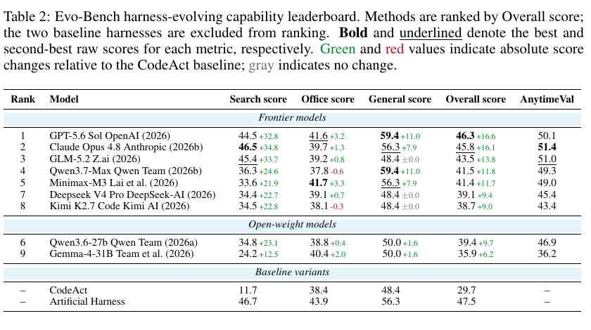

# Benchmarking agents that improve their own harness

Language: English; [中文](2608.09096.md)

> Primary: [`EV`](https://github.com/legendtkl/agent-paper-daily/blob/main/docs/categories.en.md#ev); secondary: [`LT`](https://github.com/legendtkl/agent-paper-daily/blob/main/docs/categories.en.md#lt), [`AF`](https://github.com/legendtkl/agent-paper-daily/blob/main/docs/categories.en.md#af)

## Metadata

- Authors: Lisheng Huang, Chen Yang, Hao Zhou, Huatong Song, Zongchao Chen, Ran Le, Yang Song, Wayne Xin Zhao, and Tao Zhang
- Affiliations: Gaoling School of Artificial Intelligence at Renmin University of China, and BOSS Zhipin
- arXiv: <https://arxiv.org/abs/2608.09096>; PDF: <https://arxiv.org/pdf/2608.09096>
- Code: <https://github.com/RUCAIBox/Evo-Bench> (Apache 2.0); dataset: <https://huggingface.co/datasets/RUC-AIBOX/Evo-Bench> (CC BY 4.0); project: <https://evobench.org/>
- Version and dates: v2; first submitted 2026-08-10 03:49:28 UTC and revised 2026-08-11 02:53:55 UTC; v1 appeared in the 2026-08-11 arXiv batch
- Research and review date: 2026-08-12
- Popularity evidence: 10 Hugging Face Daily Papers upvotes and one author-submitter comment; GitHub had 2 stars, 0 forks, and 0 open issues; dataset had 55 downloads and zero likes; collected 2026-08-12 09:08-09:16 Asia/Shanghai

## Conclusion summary

- Evo-Bench defines harness improvement as long-horizon executable engineering: it fixes the policy model and evaluation protocol while varying the model that edits the harness.
- The benchmark covers Search, Office, and General domains with 160 visible validation tasks and 448 held-out tasks. Twelve auxiliary harnesses measure which tasks respond to harness quality before selection.
- All nine evolvers improve the minimal CodeAct harness by 6.2-16.6 points. GPT-5.6-Sol raises the overall score from 29.7 to 46.3 but remains below the domain-specific human-harness composite at 47.5.
- Gains are domain-dependent: Search improves strongly, Office changes by roughly zero to three points for most models, and some evolved harnesses exceed the human system on General tasks.
- The evidence has major boundaries: each main configuration runs once, the most expensive evolution exceeds USD 500, and task selection favors harness-sensitive tasks.

## Research question and background

Agent performance depends on harness code for state, tools, memory, verification, and control flow. Existing work often proposes an optimizer but does not isolate which base model is best at harness engineering. Evo-Bench fixes the policy model, seed harness, tools, budget, and held-out tasks to compare evolver models.

## Method

An evolver reads validation scores, trajectories, and diagnostics, then formulates hypotheses, edits the policy harness, and requests evaluation. Runs are capped at 20 iterations, 1,000 evolver steps, and 48 hours; the final revision is frozen and evaluated on 448 unseen tasks.

Tasks come from BrowseComp, HLE, GDPval, APEX-Agents, and Claw-Eval. The authors generate 73 harness variants on independent auxiliary tasks, choose 12 representative harnesses, and compute each candidate task's Pearson correlation with leave-one-task-out harness quality. Non-positive tasks are removed, then the remainder is selected by sensitivity within difficulty strata. This increases discriminative power but deliberately shifts the distribution toward tasks where harness differences are visible.

## Experiments and evidence

DeepSeek-V4-Flash is the fixed policy model and Qwen3.7-Plus is the fixed judge. The benchmark compares seven frontier and two open-weight evolvers.

The CodeAct baseline scores 29.7 overall. GPT-5.6-Sol reaches 46.3 (+16.6), Claude Opus 4.8 reaches 45.8 (+16.1), GLM-5.2 reaches 43.5 (+13.8), and Qwen3.7-Max reaches 41.5 (+11.8). The human-engineered composite remains higher at 47.5.

For GPT-5.6-Sol, Search rises from 11.7 to 44.5, Office from 38.4 to 41.6, and General from 48.4 to 59.4. Some Office results regress slightly.

Budget ablations from 24 hours/10 iterations/500 steps to 48 hours/20 iterations/1,000 steps show monotonic gains for Qwen3.7-Max and GLM-5.2. Cross-policy tests retain large improvements. The main configurations run once. GPT-5.6-Sol costs more than USD 500 for the evolver alone; GLM-5.2 and Qwen3.7-Max cost under USD 40, excluding policy and judge costs.

> Table 2, paper page 7. Green values are absolute gains over CodeAct. The Artificial Harness row combines three domain-specific systems rather than one general harness. Every main configuration runs once.

## Limitations and risks

**Author-stated boundaries.** The initial release covers Search, Office, and General tasks; Coding and scientific research are future work. Office requires specialized workflows, and evolvers can saturate early, emit invalid code, or damage good late-stage versions.

**Research inference.** Single runs cannot separate model skill from stochasticity at temperature 1.0. Harness-sensitive task selection improves internal discrimination but reduces external validity. Validation and evaluation come from the same benchmark families. The human baseline is a domain-specific composite. Judge dependence and cost accounting that excludes policy and judge calls make complete reproduction more expensive than the headline figures.

## Reproduction and application

The Apache-2.0 repository includes the framework, configs, construction scripts, tests, seed policy harness, and artifacts; the dataset uses CC BY 4.0. Full reproduction still requires 2026 frontier endpoints, up to 1M-token contexts, long runs, and substantial policy evaluation.

The strongest reusable design choices are validation/held-out separation, evolution/policy sandbox isolation, and immutable evaluation snapshots. The benchmark can support model comparison, harness-evolution regression, and research on long-running experiment agents.

## Related work

- [Meta-Harness](https://arxiv.org/abs/2603.28052): searches executable harness code; Evo-Bench compares base models as evolvers rather than proposing an optimizer.
- [HarnessX](https://arxiv.org/abs/2606.14249): a composable and evolvable harness foundry; Evo-Bench turns this improvement capability into evaluation.
- [Harness Updating Is Not Harness Benefit](https://arxiv.org/abs/2605.30621): separates artifact generation from task benefit; Evo-Bench uses held-out tasks and frozen revisions.
- [EvoAgentBench](https://arxiv.org/abs/2607.05202): evaluates self-evolution through capability transfer; Evo-Bench focuses on long-horizon code evolution of one general harness.
- [HarnessOpt-Bench](https://arxiv.org/abs/2608.06301): controls optimizer, starting harness, and budget; Evo-Bench treats the base model itself as the harness engineer.

## Community response

No verifiable third-party technical assessment was found. The sole Hugging Face comment is from an author and restates the abstract; ten upvotes measure platform attention only. Exact Hacker News searches did not match; all six specified Reddit communities returned HTTP 403; public X search did not match; and GitHub had no issues or discussions at collection time.

## Research judgment

Reading priority: high. Confidence: medium-high. Best suited to self-improving agents, harness engineering, long-running research agents, and evaluation methodology.

Weighted score: 88/100 - agent relevance 5.0/5, contribution 4.4/5, evidence 4.3/5, reproducibility 4.0/5, freshness 5.0/5, verifiable attention 2.8/5. Controlled attribution, held-out tasks, ablations, and open artifacts support the core claim; single runs, task-selection bias, and cost constrain generalization.

This is the tenth paper in the rolling window and reaches the relaxed cap. It clears the 85-point threshold and does not duplicate SWE-Bench ProMax. Its overlap with HarnessOpt-Bench is justified by a different object of study: the foundation model as harness engineer rather than the optimizer design.

## Sources

- arXiv: <https://arxiv.org/abs/2608.09096>
- PDF: <https://arxiv.org/pdf/2608.09096>
- Code: <https://github.com/RUCAIBox/Evo-Bench>
- Dataset: <https://huggingface.co/datasets/RUC-AIBOX/Evo-Bench>
- Project: <https://evobench.org/>
- Hugging Face Daily Papers: <https://huggingface.co/papers/2608.09096>
- Hacker News exact search: <https://hn.algolia.com/?q=%222608.09096%22>
- Reddit search: <https://www.reddit.com/search/?q=%222608.09096%22>
- X search: <https://x.com/search?q=%222608.09096%22&src=typed_query>
