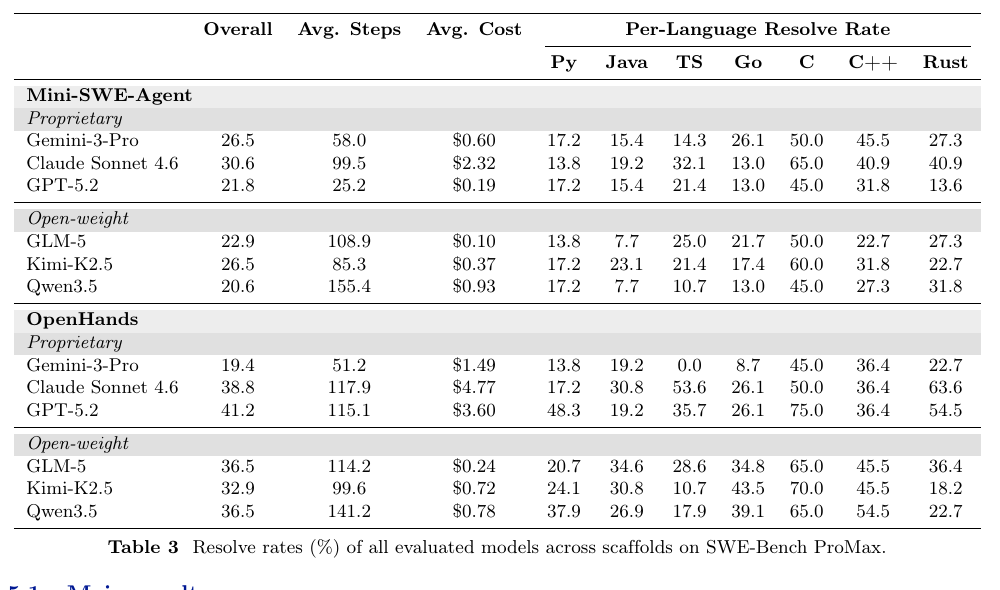

# 跨文件重构正在暴露 Coding Agent 的能力上限

语言：中文；[English companion](2608.09802.en.md)

> 主分类：[`EV`](https://github.com/legendtkl/agent-paper-daily/blob/main/docs/categories.md#ev)；辅助分类：[`SE`](https://github.com/legendtkl/agent-paper-daily/blob/main/docs/categories.md#se)、[`SY`](https://github.com/legendtkl/agent-paper-daily/blob/main/docs/categories.md#sy)

## 元数据

- 英文标题：SWE-Bench ProMax: Benchmarking Agents on Large-Scale Multilingual Code Refactoring
- 作者：Yuling Shi、Jinghan Xu、Kelin Fu、Wenhao Zeng、Shilin He、Lei Zhang、Yue Liu、Zelin Zhao、Terry Yue Zhuo、Jialun Cao、Siyu Ye、Tianyu Liu、Kai Cai、Shing-Chi Cheung、Xiaodong Gu
- 机构：上海交通大学、北京大学、香港科技大学、抖音集团、中国科学院大学、新加坡国立大学、莫纳什大学
- arXiv：<https://arxiv.org/abs/2608.09802>；PDF：<https://arxiv.org/pdf/2608.09802>
- 数据集：<https://huggingface.co/datasets/swe-bench-promax/SWE-Bench-ProMax>；170 个实例公开且无需申请访问；仓库许可证随上游项目分别为 MIT、Apache 2.0、BSD 等，数据集卡截至采集时未声明统一许可证
- 版本与时间：v1；首次提交与最近修订均为 2026-08-10 16:23:19 UTC；2026-08-11 arXiv 批次新投稿；论文标注 COLM 2026
- 调研日期与复查日期：2026-08-12
- 热度证据：Hugging Face Daily Papers 116 票、1 条提交者评论；数据集 49 次下载、0 个 like；采集时间 2026-08-12 09:08～09:16（Asia/Shanghai）
- 社区评价来源：Hugging Face、Hacker News、六个指定 Reddit 社区、GitHub、X 公开搜索和 arXiv；采集时间同上

## 结论摘要

- SWE-Bench ProMax 把 Coding Agent 评测从常见的局部修复推进到行为保持的大规模重构：170 个实例覆盖 70 个仓库和 7 种语言，金标准补丁平均修改 11.4 个源文件、261.6 行代码。
- 数据从 29,782 个候选收缩到 170 个实例；作者重写任务描述、审查测试范围，并为每个实例提供预构建 Docker 环境，评测对象和执行条件较清楚。
- 6 个模型在 Mini-SWE-Agent 与 OpenHands 两种脚手架上完整运行 170 个实例，最佳结果只有 41.2%；同一 GPT-5.2 从 21.8% 提高到 41.2%，说明脚手架对结论影响很大。
- 失败轨迹通常修改的文件少于金标准补丁，却消耗更多步骤；主要瓶颈不是找不到核心文件，而是无法把结构变化完整传播到调用点、配置、文档和测试。
- 证据足以支持「当前 Coding Agent 仍不擅长长程跨文件协调」，但所有配置只报告一次 Pass@1，没有重复运行、置信区间或人工评审一致性数据。

## 研究问题与背景

SWE-bench Verified 等仓库级基准逐渐饱和，同时暴露测试过窄、测试过宽和训练污染问题。多数现有任务仍集中在缺陷修复或功能实现，修改范围较小。论文转向更接近长期维护的代码重构：Agent 必须在不改变外部行为的前提下理解大型仓库、协调多文件改动并保持测试通过。

## 核心方法

每个实例包含预重构仓库、明确的问题描述、执行式测试套件和原开发者金标准补丁。Agent 在隔离容器中自主编辑仓库；只有全部测试通过才算解决，指标为 Pass@1 resolve rate。

构造流程分三阶段。第一阶段从至少 500 stars、具有批准许可证、主语言占比至少 80% 的仓库中检索 2025 年以后含「refactor」但不含「bug fix」的提交。第二阶段构建 Docker 环境、应用金标准补丁并运行测试，淘汰环境或测试失败的候选。第三阶段由专家在 LLM 辅助下过滤简单实例、检查测试范围、重写自足的任务描述，再复核描述、测试与金标准补丁的一致性。

## 实验与证据

实验覆盖 Gemini-3-Pro、Claude Sonnet 4.6、GPT-5.2、GLM-5、Kimi-K2.5 和 Qwen3.5。两种脚手架统一设置 300 步和每实例 10 美元上限，并在全部 170 个实例上运行。

OpenHands 下 GPT-5.2 最高，为 41.2%，平均 115.1 步、3.60 美元；Claude Sonnet 4.6 为 38.8%、4.77 美元；GLM-5 与 Qwen3.5 均为 36.5%，成本分别为 0.24 与 0.78 美元。Mini-SWE-Agent 下 GPT-5.2 只有 21.8%，表明更丰富的运行时工具对大规模重构很关键。

语言结果没有单一赢家：Claude Sonnet 4.6 在 TypeScript 与 Rust 上分别为 53.6% 和 63.6%，GLM-5 在 Java 上为 34.6%，GPT-5.2 在 Python 与 C 上为 48.3% 和 75.0%。论文没有给出语言差异的因果解释，只推测与训练数据和架构有关。

> 原文 Table 3，论文第 8 页。该表支持「脚手架影响显著」「开放权重模型具有成本优势」两项判断；结果是单次 Pass@1，不能据此估计方差或统计显著性。

## 局限与风险

**作者明确边界。** 论文把评测限定为公开仓库的大规模重构；语言差异可能受训练数据影响。任务描述和测试审查使用 LLM 辅助，但由人工主导。

**调研推断。** 所有模型—脚手架组合只报告一次运行，没有方差、重采样或统计检验；逐语言样本只有 20～29 个，百分比易受少数实例影响。作者声称测试「当且仅当」正确重构时通过，但没有报告标注者数量、复核一致性或独立审计。任务来自 2025 年后的公开提交，仍不能完全排除模型接触代码或提交历史。重构任务由金标准提交反推，可能偏向原实现路径，并不覆盖真实团队中的需求协商与非功能约束。

## 复现与应用

数据集公开 170 个实例，包含问题描述、仓库信息、补丁与评测字段；论文说明每个实例有预构建 Docker 容器。复现需要 Mini-SWE-Agent 或 OpenHands、论文所用模型、每实例 300 步和 10 美元预算。完整跑一次至少涉及 12 个模型—脚手架组合和 2,040 次实例执行，实际成本与并发时间不低。

适合用于 Coding Agent 回归、跨文件计划保持、脚手架对照、开放权重模型成本评估，以及大型重构失败轨迹分析。部署团队可重点监控「修改覆盖率」「重复读改—回滚循环」和跨文件依赖传播。

## 相关工作

- [SWE-bench](https://arxiv.org/abs/2310.06770)：建立真实 GitHub Issue 的仓库级执行评测；本文改用更大规模的重构任务，并加强描述与测试审查。
- [SWE-bench Pro](https://arxiv.org/abs/2509.16941)：提高任务难度并重写问题描述；本文进一步强调多语言和行为保持重构。
- [Multi-SWE-bench](https://arxiv.org/abs/2504.02605)：扩展多语言仓库级评测；本文提供 7 种语言的重构专门集。
- [SWE-EVO](https://arxiv.org/abs/2512.18470)：面向长程软件演化，平均修改文件更多；本文增加人工测试范围审查与重构限定。
- [SWE-Refactor](https://arxiv.org/abs/2602.07379)：聚焦 Java 重构且规模更大；本文以较小规模换取多语言和逐实例专家审查。

## 社区评价

未检索到可核验的第三方技术评价。Hugging Face 的 1 条评论来自提交者，仅称其为更复杂的 Coding Agent 新基准，属于作者侧介绍，不作为第三方评价。Hacker News 对 arXiv ID 和标题的精确检索未命中；六个指定 Reddit 社区均返回 HTTP 403；GitHub 未找到官方代码仓库；X 公开搜索未命中可核验讨论。Hugging Face 的 116 票只反映聚合平台关注度，不代表基准质量共识。

## 调研判断

阅读优先级：高。可信度：高。适合负责 Coding Agent 评测、软件工程基准、Agent 脚手架和成本治理的研究者与工程团队。

加权评分 92/100：Agent 相关性 5.0/5、研究贡献 4.5/5、实验证据 4.6/5、可复现性 4.4/5、新鲜度 5.0/5、可验证关注度 4.8/5。公开数据、全量执行和双脚手架对照支持主要结论；单次运行与缺少独立标注审计限制更强的统计主张。

本篇作为滚动 7 天窗口第 9 篇，超过 85 分放宽门槛；其跨语言重构评测与 Evo-Bench 的 Harness 演化能力评测不重复。后续应观察容器完整发布、统一数据许可证、独立复跑、测试 Oracle 审计，以及模型对公开提交历史的污染分析。

## 来源

- arXiv：<https://arxiv.org/abs/2608.09802>
- PDF：<https://arxiv.org/pdf/2608.09802>
- 数据集：<https://huggingface.co/datasets/swe-bench-promax/SWE-Bench-ProMax>
- Hugging Face Daily Papers：<https://huggingface.co/papers/2608.09802>
- Hacker News 精确检索：<https://hn.algolia.com/?q=%222608.09802%22>
- Reddit 搜索：<https://www.reddit.com/search/?q=%222608.09802%22>
- X 搜索：<https://x.com/search?q=%222608.09802%22&src=typed_query>
