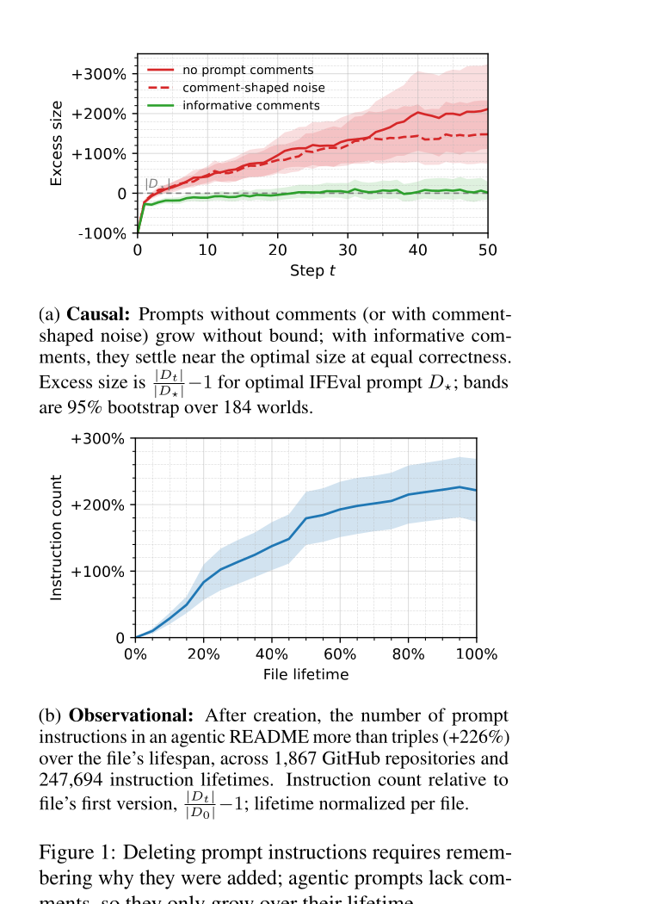

# Agent 指令为何只增不减

语言：中文；[English companion](2608.11095.en.md)

> 主分类：[`KM`](https://github.com/legendtkl/agent-paper-daily/blob/main/docs/categories.md#km)；辅助分类：[`SE`](https://github.com/legendtkl/agent-paper-daily/blob/main/docs/categories.md#se)、[`LT`](https://github.com/legendtkl/agent-paper-daily/blob/main/docs/categories.md#lt)、[`EV`](https://github.com/legendtkl/agent-paper-daily/blob/main/docs/categories.md#ev)

## 元数据

- 英文标题：Why Does CLAUDE.md Keep Growing? Catastrophic Remembering in Agentic Coding
- 作者：Kushal Chakrabarti
- 机构：South Park Commons
- arXiv：<https://arxiv.org/abs/2608.11095>；PDF：<https://arxiv.org/pdf/2608.11095>
- 代码与数据：论文称将发布派生表及重建代码，但 arXiv 页面与 PDF 未给出可核验仓库 URL；原始仓库内容不再分发。IFEval 输入采用 Apache 2.0；上游仓库采样框架没有许可证文件
- 版本与时间：v1；首次提交与最近修订均为 2026-08-11 16:00:55 UTC；2026-08-12 arXiv 批次新投稿
- 调研日期与复查日期：2026-08-13
- 热度证据：Hacker News 3 points、0 comments；Hugging Face Papers API 返回 404；未找到论文专用 GitHub 仓库。采集时间：2026-08-13 09:03～09:17（Asia/Shanghai）
- 社区评价来源：Hacker News、Hugging Face、GitHub、六个指定 Reddit 社区、可访问的 X 公开搜索和 arXiv；采集时间同上

## 结论摘要

- 论文把 Coding Agent 指令文件持续膨胀解释为「灾难性记忆」：新增规则成本低，删除旧规则却需要恢复当时的理由；问题不是模型忘记规则，而是维护者忘记规则为什么存在。
- 观测研究覆盖 1,867 个 GitHub 仓库、299,440 次文件转移和 247,694 个指令生命周期。Agent 指令文件在生命周期内平均增长 226%，每次提交净增 4.9 条指令；指令越老，删除概率越低。
- 受控 IFEval 反演实验把「指令」与「为何写入」分离。51 步后，无注释组的冗余为 +211.3%，带信息注释组为 +1.4%，两组约束满足率均为 44.0%。
- 在 64 个 WildIFEval 世界中，16 条噪声规则使已有正确规则的满足率下降 24.1 个百分点；信息注释把满足率从 50.4% 提高到 62.0%，但该结果依赖 LLM Judge，不是可执行真值。
- 结论支持「为 Agent 指令记录理由与结果」，不支持自动删除规则。论文自己的协议会清空 12.1% 的世界，作者明确建议安全相关规则保留人工删除门禁。

## 研究问题与背景

CLAUDE.md、AGENTS.md 与 copilot-instructions.md 会被 Coding Agent 反复读取。现有实践通常在失败后追加一条新规则，却很少保存触发失败、候选假设与后续验证结果。时间一长，后来的维护者只能看到「做什么」，看不到「为什么」，删除任何一条都可能带来不可见回归。

论文区分三种机制：过时规则应随年龄更容易被删除；脆弱规则会早死，幸存规则因此更稳定；不完全回忆则使规则越老越难删除。作者用删除风险随年龄和作者数量的变化区分这些解释，再用受控环境验证「保存理由」是否改变增长轨迹。

## 核心方法

观测部分从公开 GitHub 仓库历史重建 Agent 指令文件的逐版本变化，用行级匹配追踪指令的出生、保留、改写和删除，并以生存分析估计删除风险。论文预先设定 5 个判据，再检查重写、迁移、作者数量和内容差异能否解释年龄效应。

受控部分反演 IFEval：把公开指令隐藏为世界的最小覆盖，把其验证器保留为不可见约束，并只给维护者一个概括目标。无注释组只传递指令；安慰剂组传递类似注释的噪声；处理组在注释中记录失败、假设、复发次数和结果。Harness 在执行前剥离注释，因此注释只服务后续维护者，不直接影响执行模型。

WildIFEval 实验保留 4～5 条真实规则，加入 16 条其他任务的噪声规则，再比较维护三轮后的约束满足率。评审模型只看到单条约束和回答，不看到实验分组；作者用第二个 Judge 复核方向一致性。

## 实验与证据

仓库语料最终包含 1,801 个多版本文件、299,440 次转移和 247,694 个指令生命周期，其中 28,426 个以删除结束。平均文件在生命周期内增长 226%，每次提交净增 4.9 条指令；删除风险的 log-hazard 斜率为 -0.032/commit。内容聚类和多作者交互没有消除负斜率，支持「理由随时间丢失」而非单纯规则过时。

在 552 条 15 步历史中，无注释、噪声注释和信息注释的最终冗余分别为 +60.4%、+53.2% 和 -5.8%；最终约束满足率为 39.0%、40.3% 和 38.2%，置信区间重叠。51 步实验各使用 184 个世界，但只跑 1 个种子；冗余分别为 +211.3%、+147.9% 和 +1.4%，信息注释没有以正确率换取压缩。

WildIFEval 中，加入 16 条噪声规则使已有正确规则的满足率从 65.6% 降到 41.5%，差值为 -24.1 个百分点，95% CI 为 [-33.4, -14.9]。信息注释相对无注释把三轮后的总体满足率从 50.4% 提高到 62.0%，差值 11.6 个百分点，95% CI 为 [5.1, 18.3]；第二个 Judge 得到 7.8 个百分点，两个 Judge 的差异区间覆盖 0。

> 原文 Figure 1，论文第 1 页。上图把受控实验与真实仓库的增长轨迹并列，支持「信息注释抑制冗余」「真实指令文件持续增长」两项结论；观测曲线不能单独证明因果，51 步受控实验也只有 1 个随机种子。

## 局限与风险

**作者明确边界。** 50% 重写阈值和迁移规则删失了 77.3% 的死亡事件；匹配器只在 50 条人工标注转移上验证；语料分段规则没有系统变化。受控实验使用 2～3 条最小指令、15 或 51 步、同一模型充当维护者与执行者。WildIFEval 使用 LLM Judge，两个 Judge 的一致方向不能替代真值。

**调研推断。** 单一作者完成手工标注，缺少独立复核；51 步关键实验只跑 1 个种子。仓库语料未报告语言、编程语言与领域分布，不能外推到非英文指令、系统提示或完整 Skill。最重要的部署风险是把「存在注释」误当作「可以删除」：处理组有 12.1% 的世界最终为空，且这些世界的满足率更低。

## 复现与应用

论文记录规范较完整：受控实验共 49,680 次模型调用、3,790 万 tokens、45 model-hours；CPU 环境为 8 vCPU、16 GiB，模型与解码设置固定在配置和锁文件中。作者称发布派生逐指令表和重建代码，但截至采集时没有可核验 URL，因此当前不能独立执行完整复现。

工程上可以先采用风险较低的部分：每条新增指令同时记录触发失败、假设、验证结果、复发次数和适用范围；执行时只把操作规则传给 Agent，维护时再读取理由。删除应采用变更审查、回归任务和可回滚提交，安全与合规规则不应自动删除。

## 相关工作

- [Agent READMEs](https://arxiv.org/abs/2511.12884)：测量 Agent 上下文文件的内容与演化；本文进一步追踪逐指令生命周期并提出删除风险机制。
- [IFEval](https://arxiv.org/abs/2311.07911)：提供可验证的指令遵循约束；本文将它反演成最小覆盖已知的维护世界。
- [WildIFEval](https://arxiv.org/abs/2506.13538)：收集真实复杂指令；本文用它测量噪声规则对现实提示的干扰。
- [MemGPT](https://arxiv.org/abs/2310.08560)：用分层内存和换页管理上下文；本文关注人工维护的 Agent 指令为何难以安全遗忘。
- [Mem0](https://arxiv.org/abs/2504.19413)：按矛盾和时间更新记忆；本文主张作者规则的保留依据应是可恢复的写入理由，而非单纯新旧程度。

## 社区评价

未检索到可核验的第三方技术评价。Hacker News 条目为 3 points、0 comments，只能说明出现了论文链接，不能形成支持或质疑样本。Hugging Face Papers API 返回 404；GitHub 未找到论文专用仓库；六个指定 Reddit 社区均返回 HTTP 403；可访问的 X 公开搜索未找到精确讨论。平台访问和时间窗口限制意味着「未检索到」不等于「没有讨论」。

## 调研判断

阅读优先级：高。可信度：中高。适合维护 Coding Agent 指令、Skill、长期记忆与上下文治理的研究者和工程团队。

加权评分 89/100：Agent 相关性 5.0/5、研究贡献 4.8/5、实验证据 4.6/5、可复现性 3.5/5、新鲜度 5.0/5、可验证关注度 1.0/5。大规模真实语料、预设判据和受控实验相互支撑；工件 URL 缺失、单一人工标注与关键长程实验单种子限制更强结论。

本篇作为滚动 7 天窗口第 9 篇，达到 85 分以上放宽门槛。它研究 Agent 指令的知识治理，与 REDAgentBench 的可执行安全评测不重复。后续应观察公开工件、独立语料复核、多语言上下文文件、不同维护者／执行者模型，以及安全规则上的人工删除实验。

## 来源

- arXiv：<https://arxiv.org/abs/2608.11095>
- PDF：<https://arxiv.org/pdf/2608.11095>
- Hacker News：<https://news.ycombinator.com/item?id=49268790>
- Hugging Face Papers：<https://huggingface.co/papers/2608.11095>
- GitHub 搜索：<https://github.com/search?q=%222608.11095%22&type=repositories>
- Reddit 搜索：<https://www.reddit.com/search/?q=%222608.11095%22>
- X 搜索：<https://x.com/search?q=%222608.11095%22&src=typed_query>
