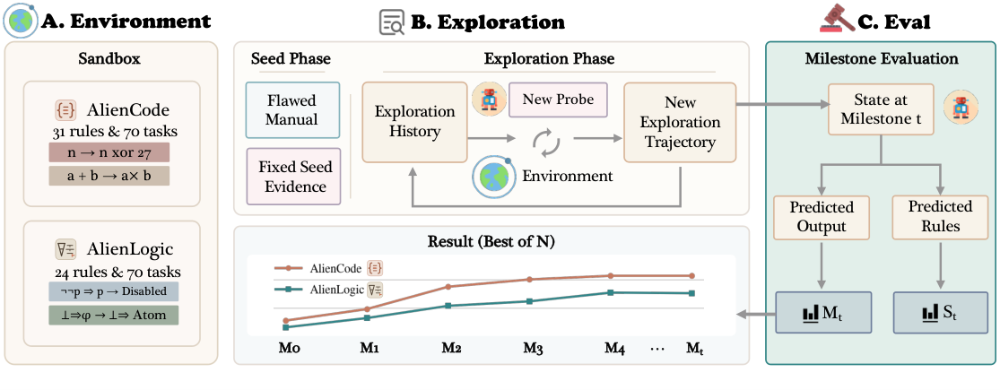

# 用可验证外星世界测量 Agent 探索

中文 | [English](2609.30199.en.md)

> 主分类 EV；辅助分类 RP、RA：[`EV`](../../../docs/categories.md#ev)；[`RP`](../../../docs/categories.md#rp)；[`RA`](../../../docs/categories.md#ra)

## 元数据

- 英文原标题：ExplorationBench: Measuring AI Systems' Exploration in Verifiable Alien Worlds
- 作者：Ming Zhang、Zhenghao Xiang、Peizhong Gao、Yujiong Shen、Yuhui Wang、Zhonghan Yue、Shihan Dou、Zhangyue Yin、Junjie Ye、Shichun Liu、Weihuang Zheng、Jiahao Chen、Jiayi Chen、Hongzhang Liu、Jiaqi Shao、Tao Gui、Qi Zhang、Xuanjing Huang、Suncong Zheng、Maxm Pan
- 机构：复旦大学、腾讯混元团队、腾讯、清华大学
- arXiv ID／版本：2609.30199／v1；首次提交：2026-09-24 17:37:14 UTC（Asia/Shanghai：2026-09-25 01:37:14）；最近修订时间同首次提交
- 公布批次：2026-09-25；调研／复查日期：2026-09-28；证据采集：2026-09-28 09:04～09:18（Asia/Shanghai）
- arXiv：<https://arxiv.org/abs/2609.30199>；PDF：<https://arxiv.org/pdf/2609.30199>
- 飞书独立调研：<https://bytedance.larkoffice.com/docx/I6wJdyPY0oHH0vxxUlBchY5UnMd>
- 项目页与排行榜：<https://explorationbench.com/>；项目页说明评测任务不公开，外部模型需联系作者代跑；未找到独立代码、数据或模型仓库
- 热度：Hugging Face Daily Papers API 为 12 票；Hacker News 精确标题与 arXiv ID 无论文专属命中；未找到官方 GitHub 仓库
- 社区评价来源：SURL AI News、Paperium、Clauday；未检索到独立复跑

## 结论摘要

- ExplorationBench 用两个规则可执行、但故意违背常识的「外星世界」测量 Agent 是否会主动选实验、积累证据、形成规则并迁移到未见任务，而不是只测静态推理或预训练记忆。
- AlienCode 包含 31 个发现目标和 70 个留出任务，AlienLogic 包含 24 个修改规则和 70 个留出定理；答案分别由解释器与证明检查器精确评分，不依赖 LLM judge。
- 10 个系统在每个沙箱运行 3 条独立轨迹。AlienCode 的 Best@3 从探索前最高 15.7% 提高到 87.6%，无工具但增加相同轮数的对照仅为 0.5%～11.0%；自主选择探针在 9／10 个系统上优于 hindsight 重放。
- 「发现规则」不等于「正确使用规则」：所需规则都被正确陈述时，任务仍只解决 70.9%；同模型同预算的 AlienCode 轨迹端点最大相差 72.8 个百分点，6／30 条轨迹最终还低于此前最佳里程碑至少 3 个百分点。
- 研究只覆盖 2 个确定性合成世界和 4 轮探索；每系统仅 3 条轨迹，私有任务又阻止第三方完整复现。它测的是可验证合成环境中的规则习得，不是现实科学发现能力。

## 研究问题与背景

科研或工程 Agent 的关键能力不只是回答已知问题，还包括决定该收集什么证据、根据实验结果修正假设，并把新规则用于未见任务。现有静态基准很难排除预训练记忆；真正开放的科学发现又缺少便宜、即时且可靠的 ground truth。论文试图同时解决「任务必须陌生」与「结果必须可精确核验」之间的矛盾。

首要贡献是新的评测协议与可执行基准，因此主分类为 `EV`。Agent 自主设计探针并按反馈规划下一步，对应 `RP`；目标语境是科研探索与实验设计，对应 `RA`。

## 核心方法

AlienCode 是一个熟悉语法下采用隐藏语义的小型程序语言；例如整数会先与 27 做 XOR，部分操作符的含义或索引规则也被修改。AlienLogic 修改自然演绎规则，并包含可证明与不可证明的留出定理。两个世界都提供一本含错误的说明书与固定种子示例，让模型不能靠常识直接作答。

每条轨迹连续探索 4 轮。模型在 AlienCode 中提交程序探针，在 AlienLogic 中提交证明探针；环境执行后返回有限反馈。每轮结束时，系统复制当前对话，禁用工具，分别输出规则报告并回答 70 个留出问题；该评测副本随后丢弃，因此测试答案不会进入下一轮上下文。

实验比较自主探索、hindsight 重放、固定探针、无工具额外推理、直接回答与 open-book 六类条件。主指标 Best@3 是同系统 3 条独立轨迹中终点最高的一条；论文同时报告 Mean@3、最差轨迹与全部端点，避免把 Best@3 误作稳定性。

> Figure 2，论文 PDF 第 2 页。该图说明「环境—探索—里程碑评测」协议；不表示任务已公开或可由第三方独立复跑。来源：[官方 PDF](https://arxiv.org/pdf/2609.30199)。

## 实验与证据

论文评测 10 个前沿系统，每个系统在每个沙箱运行 3 条独立轨迹。每轮最多 12 次工具调用；AlienCode 全程最多 48 次调用，AlienLogic 最多 48 个证明。每个里程碑对每道题独立回答 3 次，用于把回答噪声与探索轨迹差异分开。

AlienCode 中，探索前没有轨迹超过 15.7%；四轮自主探索后的 Best@3 最高为 87.6%，7／10 个系统超过 60%。无工具条件增加相同模型轮数但不给环境反馈，终点仍为 0.5%～11.0%。自主探针在 9／10 个系统上优于对同一模型最佳探针序列的 hindsight 重放，说明「由谁基于当前历史选择实验」本身影响结果。

两个关键偏移规则进入 51／70 个 AlienCode 任务。15 条终点不低于 50% 的轨迹中有 13 条正确陈述两个规则；13 次相邻里程碑至少提高 30 个百分点的跃迁中，12 次与新发现 R15 同轮出现，11 次与 R14 同轮出现。规则数与终点相关系数为 r=0.85，但这是相关性证据。

正确陈述任务所需全部规则的 647 个任务—轨迹对，实际解题率仍只有 70.9%；错误陈述至少一条规则时仍有 34.3% 任务通过，说明自然语言规则报告只是能力的有损读出。回答重复的标准差最高为 AlienCode 4.7、AlienLogic 2.9 个百分点，但同系统探索轨迹端点最大相差 72.8 与 21.0 个百分点。6／30 条 AlienCode 轨迹和 3／30 条 AlienLogic 轨迹最终比此前里程碑低至少 3 个百分点。

预算没有完全匹配。AlienCode 的工具调用数接近上限，但 Best@3 轨迹的探索 token 从 0.34M 到 11.59M，相差超过一个数量级；论文记录而不把 token 纳入排名。不同厂商的最高 reasoning 设置也不是统一计算尺度，因此模型间排行榜不能解释为 compute-matched 比较。

## 局限与风险

作者明确限制：两个世界都是确定性、可执行且只有 4 轮；现实科学探索包含噪声、不完整观测、昂贵或不可逆实验、开放假设空间和更长时间尺度。每系统 3 条轨迹、每题 3 次回答可以暴露波动，但不足以精确估计分布。

调研推断：私有留出任务能降低污染风险，却也把完整复现权交给作者。项目页要求外部团队联系作者代跑，公开材料不足以独立核对任务覆盖、隐藏规则、解释器与排行榜。项目页当前最高分为 89.0%，而 v1 论文为 87.6%；本报告固定使用 v1 数值，不混用版本。

Best@3 回答「3 次独立尝试中是否至少出现一条强轨迹」，不表示典型可靠性。实际工程评测应同时看 Mean@3、Worst、轨迹方差、token 与工具预算，以及继续探索造成倒退的比例。

## 复现与应用

公开论文给出任务构造原则、6 类控制条件、工具调用协议、预算、验证公式、逐系统结果和案例；arXiv HTML 采用 CC BY 4.0。缺失项是完整 AlienCode／AlienLogic 任务、隐藏输入、解释器／证明检查器与可执行脚本，未找到公开数据、模型或代码仓库。

该协议适合验证科研 Agent、未知 API 学习和工具发现系统：让规则违背已有先验，限制探针预算，将「探索历史」与「无工具留出评测」隔离，并同时记录规则陈述与可执行终态。工程上还应加入信念检查点和回归测试，避免后续探索覆盖已经正确的规则。

## 相关工作

- [DiscoveryWorld](https://openreview.net/forum?id=cDYqckEt6d)：在虚拟世界中评测科学调查；ExplorationBench 更强调违背先验的规则、精确验证和探索后迁移。
- [MARS](https://openreview.net/forum?id=3qoQ6AolAz)：研究开放世界中的情境归纳；本篇进一步拆分自主探针、反馈与留出应用。
- [MLAgentBench](https://arxiv.org/abs/2310.03302)：让 Agent 在机器学习实验中搜索改进；本篇用人工构造世界控制污染，并提供多种匹配对照。
- [Voyager](https://arxiv.org/abs/2305.16291)：在沙箱中积累开放式技能；本篇不更新权重或长期技能库，只测单一上下文内的探索。
- [AEWM／EditAct](https://arxiv.org/abs/2609.28416)：在动作执行前修改错误状态；ExplorationBench 暴露了继续探索覆盖正确信念的问题，可为状态编辑提供评测对象。

## 社区评价

Hugging Face Daily Papers 在采集时为 12 票；没有可核验的用户评论。Hacker News 精确标题与 arXiv ID 搜索没有论文专属条目。指定 r/MachineLearning、r/LocalLLaMA、r/AI_Agents、r/ClaudeAI、r/OpenAI 和 r/vibecoding 的精确公开搜索均无命中；公开 X 精确搜索也没有可核验原帖。这些检索结果不证明没有讨论。

SURL AI News 的独立解读认可可执行评分与无工具留出评测，同时指出 Best@3 不能代表稳定性、项目页与 v1 论文数值不一致、任务不公开限制复现。Paperium 的转述支持用 Best@3 与 Mean@3 分离峰值和期望表现，但也把合成确定性、短探索窗口和少量重复列为外推风险。Clauday 强调「探索越久可能主动破坏已获得规则」的工程含义。上述来源均未提供独立运行日志，具体互动量未验证。

互动量只反映早期关注，不直接代表论文质量；Hugging Face 与技术解读平台的读者圈层也偏向模型与 Agent 从业者。

## 原文关键图表

插入 1 张官方 Figure 2，来源为论文 PDF 第 2 页与 arXiv HTML 的原图。它解释两个沙箱、连续探索历史和工具禁用后的里程碑评测；不支撑模型排名，也不能替代对表格、附录与任务公开状态的核验。

## 调研判断

阅读优先级：很高，适合 Agent 评测、科研 Agent、测试时适应、工具发现和可靠性团队。可信度：协议定义、可执行评分、控制条件、逐轨迹与预算报告较强；私有任务、少量重复、非统一 reasoning 预算和项目页数值漂移限制复现与模型排名解释。

加权维度（0～5）：Agent 相关性 5.0、研究贡献 5.0、实验证据 4.8、可复现性 2.1、新鲜度 5.0、可验证关注度 3.0；按 25%／25%／20%／15%／10%／5% 加权为 88.5，结合直接改变 Agent 探索评测边界的价值，记录为 90／100。

后续重点观察：任务与验证器是否公开、排行榜版本如何固定、更多独立轨迹下的置信区间、统一 token／调用成本后的排名，以及跨会话、含噪声和不可逆实验的外部效度。

## 来源

- arXiv 元数据：<https://arxiv.org/abs/2609.30199>
- 官方 PDF：<https://arxiv.org/pdf/2609.30199>
- arXiv HTML 与附录：<https://arxiv.org/html/2609.30199v1>
- 官方项目页与排行榜：<https://explorationbench.com/>
- Hugging Face Daily Papers：<https://huggingface.co/papers/2609.30199>
- SURL AI News 独立解读：<https://ainews.surl.tw/article/explorationbench-%E4%BB%A5%E5%8F%8D%E5%B8%B8%E8%A6%8F%E5%89%87%E6%B2%99%E7%AE%B1-%E6%8B%86%E8%A7%A3%E4%BB%A3%E7%90%86%E6%8E%A2%E7%B4%A2%E8%88%87%E7%9F%A5%E8%AD%98%E6%87%89%E7%94%A8%E8%83%BD%E5%8A%9B-a73ec941?lang=en>
- Paperium 分析：<https://paperium.net/article/img/24361/explorationbench-measuring-ai-systems-exploration-in-verifiable-alien-worlds>
- Clauday 解读：<https://clauday.com/zh/article/4b3e1c10-844c-4ee8-a411-9c9c9cb396d9>
- Hacker News 搜索：<https://hn.algolia.com/api/v1/search?query=ExplorationBench&tags=story>
